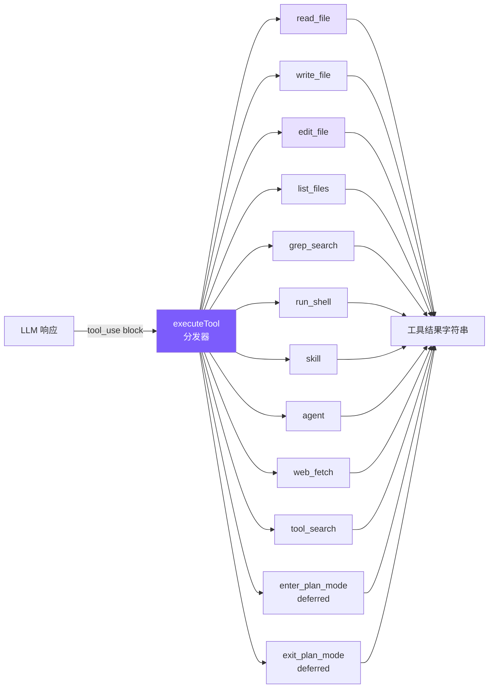
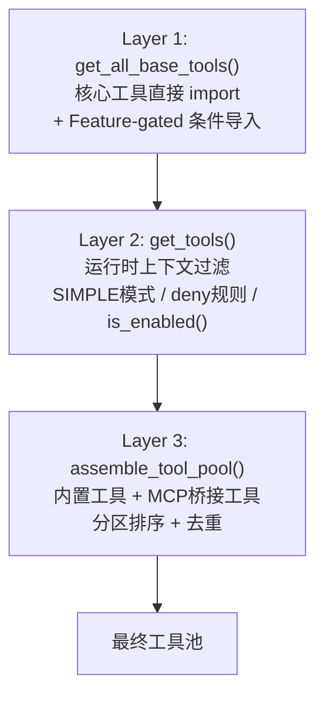
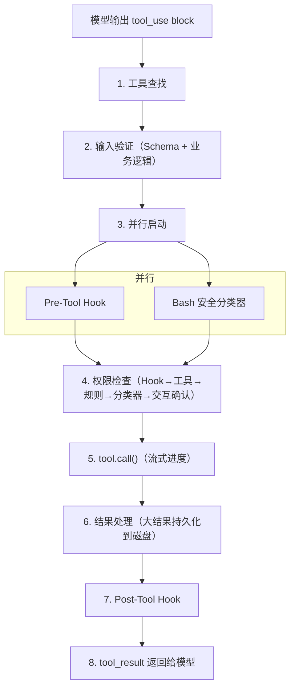

# 2. 工具系统

## 本章目标

定义 6 个核心工具（读文件、写文件、编辑文件、列文件、搜索、Shell）+ 5 个扩展工具（skill、agent、web_fetch、tool_search、plan mode），让 LLM 能真正操作你的代码库。实现编辑防护（read-before-edit + mtime 检查）和延迟加载（deferred tools）机制。



## Claude Code 怎么做的

### Tool 接口 — 每个工具的完整契约

Claude Code 的每个工具都遵循统一的 `Tool` 泛型接口，不是简单函数签名，而是完整的行为契约：

```python
# Claude Code 的 Tool 接口（简化示意）
class Tool:
    name: str
    aliases: list[str]              # 废弃别名，平滑迁移
    max_result_size_chars: int      # 超过则持久化到磁盘

    async def call(self, args, context, can_use_tool, parent_message, on_progress=None) -> ToolResult
    async def description(self, input, options) -> str  # 发给 API 的工具描述
    async def prompt(self, options) -> str              # 注入 system prompt 的使用指南

    input_schema: dict              # JSON Schema
    is_concurrency_safe: bool       # 同一工具不同参数可有不同安全语义
    is_read_only: bool
    is_destructive: bool
    async def check_permissions(self, input, context) -> PermissionResult
```

几个设计要点：

**`is_concurrency_safe(input)` 接收参数**——这意味着同一工具对不同输入可以有不同安全语义。BashTool 对 `ls` 返回 `is_read_only: True`，对 `rm` 返回 `False`。比给整个工具打标签精确得多。

**`prompt()` 方法**——每个工具可以向 system prompt 注入自己的使用指南。FileEditTool 注入"精确匹配"规则，BashTool 注入安全执行提醒。工具行为指引和工具定义紧密关联，而非散落在全局 prompt 文件里。

### buildTool 工厂 — Fail-Closed 默认值

```python
TOOL_DEFAULTS = {
    "is_concurrency_safe": False,    # 默认不可并发
    "is_read_only": False,           # 默认有写入副作用
    "is_destructive": False,
    "check_permissions": lambda: {"behavior": "allow", "updated_input": None},
}
```

这是 **fail-closed** 设计：错误标记"只读"工具为"非只读"后果是不必要的权限弹窗（烦人但安全）；反向错误——错误标记"写入"工具为"只读"——可能让它在没有权限检查的情况下并发执行（危险且隐蔽）。默认值只能选安全的方向。

### 工具注册 — 三层流水线



Layer 1 的 Feature-gated 工具通过条件导入加载：

```python
# 条件导入示例
if feature('PROACTIVE') or feature('KAIROS'):
    from tools.SleepTool import SleepTool
else:
    SleepTool = None
```

Layer 3 的分区排序：内置工具按字母序在前，MCP 工具追加在后，不做全局排序。原因是 API 服务器在最后一个内置工具之后设置了缓存断点，分区确保添加 MCP 工具不影响内置工具的缓存命中。

### 工具执行生命周期 — 8 个阶段



几个值得关注的阶段：

**Stage 2 两阶段验证**：Phase 1 是 Schema 验证（字段类型），Phase 2 是业务逻辑（如 FileEditTool 检查 old_string 是否唯一）。分离确保低成本检查先执行，减少不必要的磁盘 I/O。

**Stage 3 并行启动**：Pre-Tool Hook 和 Bash 分类器同时启动，各需数十到数百毫秒，并行化降低权限检查总延迟。

**Stage 6 大结果处理**：结果超过 `max_result_size_chars` 时，完整内容保存到磁盘，模型收到文件路径 + 截断指示符，需要时通过 FileReadTool 主动拉取。

> **核心设计哲学：错误是数据，不是异常。** 任何阶段的错误都转换为带 `is_error: True` 的 `tool_result` 返回给模型，让模型自我纠正。

### 并发控制

```python
def can_execute_tool(self, is_concurrency_safe: bool) -> bool:
    executing_tools = [t for t in self.tools if t.status == 'executing']
    return (
        len(executing_tools) == 0 or
        (is_concurrency_safe and all(t.is_concurrency_safe for t in executing_tools))
    )
```

规则很简单：非并发安全的工具必须独占执行；多个并发安全工具可以同时跑。`StreamingToolExecutor` 不等模型输出完所有 tool_use blocks，一旦检测到完整 block 就立即启动执行——工具执行延迟约 1 秒，模型流式输出持续 5-30 秒，大部分工具可以完全隐藏在流式窗口内。

并发上限 `MAX_TOOL_USE_CONCURRENCY = 10`。

### edit_file 的核心设计

FileEditTool 执行前有 14 步验证（按 I/O 成本排序：先检查内存状态，再访问磁盘），其中最关键的三个：

**读取前置检查**：代码层面的强制约束，不只是 prompt 建议。未先读取文件则拒绝执行，确保模型基于文件当前状态编辑而非过时记忆。

**外部修改检测**：通过 mtime 检测文件在读取后是否被外部修改（比如用户在 IDE 中编辑了同一个文件），解决真实竞争条件。

**配置文件保护**：对 `.claude/settings.json` 等，验证会模拟执行编辑后做 JSON Schema 校验，防止看似合理的编辑损坏配置格式。

### 为什么用 search-and-replace

在确定 search-and-replace 之前，有几种备选方案：

| 方案 | 致命缺陷 |
|------|---------|
| 行号编辑 | 位置相关：第一次插入 3 行后，后续所有行号偏移，多步编辑需要复杂重算 |
| AST 编辑 | 语法错误的文件恰恰最需要编辑，而 AST 解析器遇到语法错误会直接报错 |
| Unified diff | LLM 生成严格格式时表现很差：hunk header 行号、`+`/`-`/空格前缀任一出错则 patch 无法应用 |
| 全文件重写 | 大文件浪费 Token；模型可能遗漏未修改代码；用户无法快速 review |
| **字符串替换** | 无上述缺陷 |

search-and-replace 最被低估的优势是**幻觉安全**：模型提供了一个文件中不存在的字符串，工具直接失败，模型重新读取文件纠正记忆。全文件重写则可能静默地把错误的内容写入文件。

## 我们的简化决策

| Claude Code 的设计 | 我们的简化 | 简化理由 |
|-------------------|-----------|---------|
| 66+ 工具类，每个独立目录 | 1 个文件 + 6 个函数 | 教程不需要工业级模块化 |
| 8 阶段生命周期 | 直接 switch 分发 + 执行 | 省略 Hook、权限检查、分类器 |
| StreamingToolExecutor 并发 | 串行逐个执行 | 避免并发复杂度 |
| 14 步验证流水线 | 唯一性检查 + 引号容错 | 保留最关键的 2 个验证 |
| 三级大结果限制 | 单层 50K 截断 | 足够防止上下文爆炸 |
| MCP 7 种传输 + OAuth | 不支持 MCP | 教程聚焦核心概念 |

核心理念：**保留设计哲学，砍掉工程复杂度**。

## 我们的实现

### 工具定义：静态数组

```python
# tools.py — 工具定义（Anthropic Tool schema 格式）

tool_definitions: list[ToolDef] = [
    {
        "name": "read_file",
        "description": "Read the contents of a file. Returns the file content with line numbers.",
        "input_schema": {
            "type": "object",
            "properties": {
                "file_path": {"type": "string", "description": "The path to the file to read"},
            },
            "required": ["file_path"],
        },
    },
    # ... write_file, edit_file, list_files, grep_search, run_shell
]
```

这些定义直接传给 Anthropic API 的 `tools` 参数，格式完全一致，不需要任何转换。

**为什么用静态数组而非类？** Claude Code 用类体系是因为 66+ 工具需要继承、多态、独立测试。6 个工具用一个数组 + 一个 switch 就够了，简单性本身就是价值。

### 工具执行：switch 分发器

```python
async def execute_tool(name: str, inp: dict) -> str:
    handlers = {
        "read_file": _read_file,
        "write_file": _write_file,
        "edit_file": _edit_file,
        "list_files": _list_files,
        "grep_search": _grep_search,
        "run_shell": _run_shell,
    }
    handler = handlers.get(name)
    if not handler:
        return f"Unknown tool: {name}"
    return _truncate_result(handler(inp))
```

`default` 分支返回 `Unknown tool: {name}` 而非抛异常——体现"错误是数据"的设计，让模型能自我纠正幻觉出的工具名。

### 逐个工具详解

#### read_file

```python
def _read_file(inp: dict) -> str:
    try:
        content = Path(inp["file_path"]).read_text()
        lines = content.split("\n")
        numbered = "\n".join(f"{i+1:4d} | {line}" for i, line in enumerate(lines))
        return numbered
    except Exception as e:
        return f"Error reading file: {e}"
```

加行号是为了让 LLM 定位代码位置，但 `edit_file` 匹配时用的是实际内容字符串，不是行号。

#### edit_file — 最关键的工具

```python
def _edit_file(inp: dict) -> str:
    try:
        path = Path(inp["file_path"])
        content = path.read_text()

        # 引号容错匹配
        actual = _find_actual_string(content, inp["old_string"])
        if not actual:
            return f"Error: old_string not found in {inp['file_path']}"

        count = content.count(actual)
        if count > 1:
            return f"Error: old_string found {count} times in {inp['file_path']}. Must be unique."

        new_content = content.replace(actual, inp["new_string"], 1)
        path.write_text(new_content)

        diff = _generate_diff(content, actual, inp["new_string"])
        quote_note = " (matched via quote normalization)" if actual != inp["old_string"] else ""
        return f"Successfully edited {inp['file_path']}{quote_note}\n\n{diff}"
    except Exception as e:
        return f"Error editing file: {e}"
```

唯一匹配检查是核心：出现 0 次说明模型对文件内容记忆有误（幻觉检测），出现 > 1 次则要求模型提供更多上下文来唯一标识修改点。"宁可失败也不猜测"——静默替换第一个匹配远比告知失败危险。

#### 引号容错 + Diff 输出

LLM 的 tokenization 可能将直引号映射为弯引号（`"` → `"`），没有容错机制这类编辑会 100% 失败。

```python
def _normalize_quotes(s: str) -> str:
    s = re.sub("[‘’′]", "'", s)
    s = re.sub('[“”″]', '"', s)
    return s

def _find_actual_string(file_content: str, search_string: str) -> str | None:
    if search_string in file_content:
        return search_string
    norm_search = _normalize_quotes(search_string)
    norm_file = _normalize_quotes(file_content)
    idx = norm_file.find(norm_search)
    if idx != -1:
        return file_content[idx:idx + len(search_string)]
    return None
```

关键细节：匹配成功后返回**文件中的原始字符串**而非标准化版本，替换时保持文件原始字符风格。

编辑成功后生成简易 diff，行号通过计算 `old_string` 前面有几个 `\n` 得出：

```
Successfully edited src/app.py (matched via quote normalization)

@@ -15,1 +15,1 @@
- msg = "hello"
+ msg = "world"
```

#### write_file

```python
def _write_file(inp: dict) -> str:
    try:
        path = Path(inp["file_path"])
        path.parent.mkdir(parents=True, exist_ok=True)
        path.write_text(inp["content"])
        lines = inp["content"].split("\n")
        line_count = len(lines)
        preview = "\n".join(f"{i+1:4d} | {l}" for i, l in enumerate(lines[:30]))
        trunc = f"\n  ... ({line_count} lines total)" if line_count > 30 else ""
        return f"Successfully wrote to {inp['file_path']} ({line_count} lines)\n\n{preview}{trunc}"
    except Exception as e:
        return f"Error writing file: {e}"
```

自动创建父目录（`mkdir -p` 效果）避免模型还得额外调用 shell 命令。System Prompt 里告诉 LLM 优先用 `edit_file`，只对新文件用 `write_file`。

#### grep_search

```python
def _grep_search(inp: dict) -> str:
    pattern = inp["pattern"]
    path = inp.get("path") or "."
    include = inp.get("include")

    try:
        args = ["grep", "--line-number", "--color=never", "-r"]
        if include:
            args.append(f"--include={include}")
        args.extend(["--", pattern, path])
        result = subprocess.run(args, capture_output=True, text=True, timeout=10)
        if result.returncode == 1:
            return "No matches found."
        if result.returncode != 0:
            return f"Error: {result.stderr}"
        lines = [l for l in result.stdout.split("\n") if l]
        output = "\n".join(lines[:100])
        if len(lines) > 100:
            output += f"\n... and {len(lines) - 100} more matches"
        return output
    except Exception as e:
        return f"Error: {e}"
```

`--color=never` 禁用 ANSI 颜色代码（输出给模型看的，不需要颜色）。Python 版本的 `--` 分隔符确保以 `-` 开头的 pattern 不被误解析为 grep 选项。

grep 退出码 1 表示"无匹配"不是错误，2+ 才是真正错误，需要分别处理。结果截断为前 100 条，附加 `... and N more matches` 提示。

Claude Code 用 ripgrep (`rg`)，我们用系统 `grep`——功能够用，少一个依赖。

#### run_shell

```python
def _run_shell(inp: dict) -> str:
    try:
        timeout = inp.get("timeout", 30)
        result = subprocess.run(
            inp["command"],
            shell=True,
            capture_output=True,
            text=True,
            timeout=timeout,
        )
        if result.returncode != 0:
            stderr = f"\nStderr: {result.stderr}" if result.stderr else ""
            stdout = f"\nStdout: {result.stdout}" if result.stdout else ""
            return f"Command failed (exit code {result.returncode}){stdout}{stderr}"
        return result.stdout or "(no output)"
    except subprocess.TimeoutExpired:
        return f"Command timed out after {inp.get('timeout', 30)}s"
    except Exception as e:
        return f"Error: {e}"
```

失败时同时返回 stdout 和 stderr——很多编译器在 stderr 输出错误的同时，stdout 可能有有用的部分输出。`"(no output)"` 避免模型在命令成功但无输出时（`mkdir`、`touch`）产生困惑。

Claude Code 的 BashTool 分布在 18 个源文件中，有 AST 解析命令、沙箱执行、23 个安全检查。我们只做 timeout 保护（安全机制在第 6 章详述）。

### 工具结果截断

```python
MAX_RESULT_CHARS = 50000

def _truncate_result(result: str) -> str:
    if len(result) <= MAX_RESULT_CHARS:
        return result
    keep_each = (MAX_RESULT_CHARS - 60) // 2
    return (
        result[:keep_each]
        + f"\n\n[... truncated {len(result) - keep_each * 2} chars ...]\n\n"
        + result[-keep_each:]
    )
```

保留头尾而非只保留头部，因为很多命令的关键输出在末尾（编译错误摘要、测试结果统计）。截断提示明确告知模型内容被截断，模型可据此决定是否用 `grep_search` 或 `read_file` 获取完整内容。

### WebFetch 工具

让 Agent 能访问 URL 获取内容——查文档、读 API 响应、抓取网页信息：

```python
# tools.py — web_fetch 定义
{
    "name": "web_fetch",
    "description": "Fetch a URL and return its content as text. For HTML pages, tags are stripped.",
    "input_schema": {
        "type": "object",
        "properties": {
            "url": {"type": "string", "description": "The URL to fetch"},
            "max_length": {"type": "number", "description": "Maximum content length (default 50000)"},
        },
        "required": ["url"],
    },
}

# tools.py — web_fetch 执行
async def _web_fetch(inp: dict) -> str:
    url = inp["url"]
    max_length = inp.get("max_length", 50000)
    try:
        async with httpx.AsyncClient(timeout=30) as client:
            response = await client.get(url, headers={"User-Agent": "mini-claude/1.0"})
            response.raise_for_status()
            text = response.text
            if "html" in response.headers.get("content-type", ""):
                text = re.sub(r"<script[\s\S]*?</script>", "", text, flags=re.I)
                text = re.sub(r"<style[\s\S]*?</style>", "", text, flags=re.I)
                text = re.sub(r"<[^>]*>", " ", text)
                text = text.replace("&nbsp;", " ").replace("&amp;", "&")
                text = re.sub(r"\s{2,}", " ", text)
                text = re.sub(r"\n{3,}", "\n\n", text).strip()
            if len(text) > max_length:
                text = text[:max_length] + f"\n\n[... truncated at {max_length} characters]"
            return text or "(empty response)"
    except httpx.TimeoutException:
        return "Error: Request timed out (30s)"
    except Exception as e:
        return f"Error fetching {url}: {e}"
```

设计选择：
- **30 秒超时**：防止模型访问慢速或无响应的 URL 时阻塞整个循环
- **HTML 去标签**：LLM 不需要看 HTML 标签，纯文本更高效
- **50KB 上限**：避免网页内容挤占上下文窗口
- 标记为并发安全（只读、无副作用），可并行执行

### Read-before-edit + mtime 防护

Claude Code 的一个重要安全机制：**编辑文件前必须先读取**。这防止模型在不了解文件当前内容的情况下盲目修改，同时检测外部修改避免覆盖用户的手动编辑。

```python
# tools.py — execute_tool 中的 mtime 追踪

async def execute_tool(
    name: str,
    inp: dict,
    read_file_state: dict[str, float] | None = None,  # filepath → mtime
) -> str:
    if name == "read_file":
        result = _read_file(inp)
        # 记录文件的修改时间
        if read_file_state and not result.startswith("Error"):
            abs_path = str(Path(inp["file_path"]).resolve())
            try:
                read_file_state[abs_path] = Path(abs_path).stat().st_mtime
            except OSError:
                pass
        return result

    if name in ("write_file", "edit_file"):
        abs_path = str(Path(inp["file_path"]).resolve())
        # 已存在的文件必须先 read
        if read_file_state and Path(abs_path).exists():
            if abs_path not in read_file_state:
                return "Error: You must read this file before editing. Use read_file first."
            # mtime 变化说明文件被外部修改
            cur_mtime = Path(abs_path).stat().st_mtime
            if cur_mtime != read_file_state[abs_path]:
                return "Warning: file was modified externally. Please read_file again."

        result = _write_file(inp) if name == "write_file" else _edit_file(inp)
        # 更新 mtime
        if read_file_state and not result.startswith("Error"):
            try:
                read_file_state[abs_path] = Path(abs_path).stat().st_mtime
            except OSError:
                pass
        return result

    # ... 其他工具
```

三个关键点：
- **read_file_state dict** 在 Agent 实例中维护，key 是绝对路径，value 是上次读取时的 `mtime`
- **新文件跳过检查**：`Path(abs_path).exists()` 为 False 时不强制先读——创建新文件不需要先读
- **mtime 比较**：读取时记录 mtime，写入前比较。如果不一致，说明文件在 Agent 读取后被用户或其他进程修改了，返回警告而非静默覆盖

这与 Claude Code 的 `readFileTimestamps` 机制对齐——编辑必须基于已知状态，不能"盲写"。

### ToolSearch 延迟加载

当工具数量增多时（66+ 工具），把所有工具的 schema 都发给 API 会浪费大量 token。Claude Code 的做法是**延迟加载**：不常用的工具只发名称，模型需要时通过 `ToolSearch` 按需激活。

```python
# tools.py — deferred 标记
{
    "name": "enter_plan_mode",
    "description": "Enter plan mode to switch to a read-only planning phase...",
    "input_schema": {"type": "object", "properties": {}},
    "deferred": True,  # 标记为延迟加载
}

# tools.py — tool_search 工具
{
    "name": "tool_search",
    "description": "Search for available tools by name or keyword. Returns full schemas for matching deferred tools.",
    "input_schema": {
        "type": "object",
        "properties": {"query": {"type": "string", "description": "Tool name or search keywords"}},
        "required": ["query"],
    },
}

# tools.py — 激活逻辑
_activated_tools: set[str] = set()

def get_active_tool_definitions(all_tools=None):
    tools = all_tools or tool_definitions
    return [
        {k: v for k, v in t.items() if k != "deferred"}
        for t in tools
        if not t.get("deferred") or t["name"] in _activated_tools
    ]

# tool_search 执行：匹配 → 激活 → 返回 schema
def _tool_search(inp: dict) -> str:
    query = inp.get("query", "").lower()
    deferred = [t for t in tool_definitions if t.get("deferred")]
    matches = [t for t in deferred
               if query in t["name"].lower() or query in t.get("description", "").lower()]
    if not matches:
        return "No matching deferred tools found."
    for m in matches:
        _activated_tools.add(m["name"])
    return json.dumps([
        {"name": t["name"], "description": t["description"], "input_schema": t["input_schema"]}
        for t in matches
    ], indent=2)
```

工作流程：
1. API 调用时，`get_active_tool_definitions()` 过滤掉未激活的 deferred 工具（只发名称，不发 schema）
2. System prompt 中告知模型哪些工具可以通过 `tool_search` 激活
3. 模型需要时调用 `tool_search`，匹配的工具被加入 `_activated_tools` Set
4. 下一次 API 调用自动包含已激活工具的完整 schema

我们只有 2 个 deferred 工具（plan mode），但这个机制对扩展到 20+ 工具时至关重要。

## 简化对比

| 维度 | Claude Code | mini-claude |
|------|------------|-------------|
| **工具数量** | 66+ | 13（6 核心 + web_fetch + tool_search + skill + agent + 2 plan mode） |
| **执行模式** | 并发执行 + streaming 早期启动 | 并行执行（concurrencySafe）+ streaming 早期启动 |
| **搜索引擎** | ripgrep（rg） | 系统 grep |
| **编辑验证** | 14 步流水线 + readFileTimestamps | 引号容错 + 唯一性 + diff + read-before-edit + mtime |
| **Shell 安全** | AST 解析 + 沙箱 | 正则匹配 + 确认 |
| **结果截断** | 选择性裁剪 + 磁盘持久化 | 保留头尾 50K + 30KB 磁盘持久化 |
| **延迟加载** | deferred tools + ToolSearch | deferred 标记 + tool_search |
| **网络访问** | WebFetch（去标签 + 超时） | web_fetch（去标签 + 30s 超时 + 50KB 上限） |

---

> **下一章**：工具定义了 agent 的能力，但 System Prompt 定义了它的行为——怎么用这些工具、什么时候该小心。
