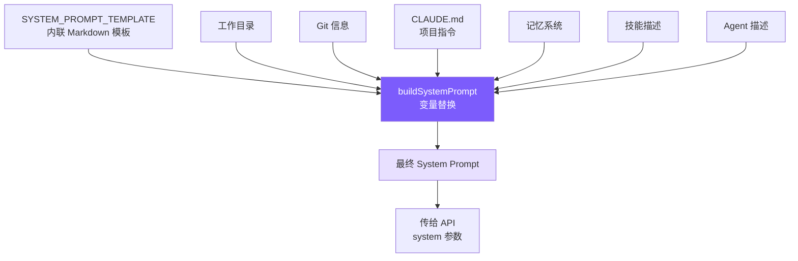

# 3. System Prompt 工程

## 本章目标

构造一个让 LLM 成为合格 coding agent 的 System Prompt：告诉它身份、规则、工具使用策略和环境信息。



## Claude Code 怎么做的

Claude Code 的 System Prompt 不是随意堆砌的指令，而是经过大量 A/B 测试和模型行为观察迭代打磨的工程产物。

### 7 层递进结构

提示词从抽象到具体分为 7 层——**先建立身份和约束框架，再填充具体行为指导**。这个顺序很重要：模型先建立的概念会成为理解后续内容的框架。

```
1. Identity   → 我是谁？interactive agent
2. System     → 运行环境的基本事实
3. Doing Tasks → 怎么写代码？（反模式接种）
4. Actions    → 哪些操作需要确认？（爆炸半径框架）
5. Using Tools → 怎么用工具？（偏好映射表）
6. Tone & Style → 输出什么格式？
7. Output Efficiency → 怎么更简洁？
```

### 反模式接种

**明确告诉模型"不要做什么"，比只描述"要做什么"有效得多。**

正面指令（"be concise"）给模型留下了自我合理化的空间——它会认为"加注释是让代码更简洁易读的"，然后给每个函数加 docstring。而负面指令（"don't add docstrings to code you didn't change"）消除了解释余地。

Claude Code 的 Doing Tasks 部分有三条精确的"不要"：

- **不要扩大范围**：修 bug 不需要顺手重构周围代码
- **不要防御性编程**：不为不可能发生的场景加 try-catch 和校验
- **不要过早抽象**："Three similar lines of code is better than a premature abstraction"

这些规则的价值不在概念（谁都知道"不要过度工程"），而在**措辞的精确度**——给了模型具体的判断标准，而非模糊的原则。

### 爆炸半径框架

Actions 部分没有罗列"不能做 X、Y、Z"，而是教给模型一个**风险评估框架**：

```
Carefully consider the reversibility and blast radius of actions.
```

二维模型：**可逆性 × 影响范围**。高风险 = 不可逆 + 影响共享环境（force push、删除云资源）；低风险 = 可逆 + 只影响本地（编辑本地文件）。

这比穷举规则扩展性强得多——模型遇到规则列表之外的新场景（比如调用 API 删除云资源）能自行推理，而不是不知道怎么做。

还有一条关键规则：用户批准一次操作，不等于批准所有类似操作。每次授权只对当前范围有效。

### 工具偏好映射表

Claude Code 在提示词中明确要求模型用专用工具而非 bash 命令：

```
Use Read instead of cat/head/tail
Use Edit instead of sed/awk
Use Glob instead of find/ls
Use Grep instead of grep/rg
```

专用工具和 bash 命令底层功能差不多，差异在用户体验：权限可以细粒度控制（读取 vs 写入分开授权）、输出结构化、原生支持并行调用。没有这张映射表，模型会默认用训练数据中出现最多的方式——即各种 bash 命令。

### CLAUDE.md 层级发现

CLAUDE.md 是项目级指令文件，类似 `.eslintrc` 但面向 AI。Claude Code 从 5 个位置加载：全局管理策略 → 用户主目录 → 项目目录（CWD 向上遍历）→ 本地文件 → 命令行指定目录。

靠近 CWD 的文件**后加载、优先级更高**——利用 LLM 的近因效应，子目录规则可以覆盖父目录规则。

## 我们的实现

### SYSTEM_PROMPT_TEMPLATE

模板内联在 `prompt.ts` 中，用 `{{placeholder}}` 标记动态变量。

`{{memory}}`、`{{skills}}`、`{{agents}}` 放在末尾——近因效应，这些动态内容的权重更大（详见第 8、9 章）。

### prompt.py 实现

```python
import os
import platform
import subprocess
from pathlib import Path


def load_claude_md() -> str:
    parts: list[str] = []
    d = Path.cwd().resolve()
    while True:
        f = d / "CLAUDE.md"
        if f.is_file():
            try:
                content = f.read_text()
                content = resolve_includes(content, str(d))  # @include 解析
                parts.insert(0, content)
            except Exception:
                pass
        parent = d.parent
        if parent == d:
            break
        d = parent
    rules = load_rules_dir(str(Path.cwd()))  # .claude/rules/*.md
    claude_md = "\n\n# Project Instructions (CLAUDE.md)\n" + "\n\n---\n\n".join(parts) if parts else ""
    return claude_md + rules


def get_git_context() -> str:
    try:
        opts = {"encoding": "utf-8", "timeout": 3, "capture_output": True}
        branch = subprocess.run(["git", "rev-parse", "--abbrev-ref", "HEAD"], **opts).stdout.strip()
        log = subprocess.run(["git", "log", "--oneline", "-5"], **opts).stdout.strip()
        status = subprocess.run(["git", "status", "--short"], **opts).stdout.strip()
        result = f"\nGit branch: {branch}"
        if log:
            result += f"\nRecent commits:\n{log}"
        if status:
            result += f"\nGit status:\n{status}"
        return result
    except Exception:
        return ""


def build_system_prompt() -> str:
    from .memory import build_memory_prompt_section
    from .skills import build_skill_descriptions
    from .subagent import build_agent_descriptions
    from datetime import date

    replacements = {
        "{{cwd}}": str(Path.cwd()),
        "{{date}}": date.today().isoformat(),
        "{{platform}}": f"{platform.system()} {platform.machine()}",
        "{{shell}}": os.environ.get("SHELL", "/bin/sh"),
        "{{git_context}}": get_git_context(),
        "{{claude_md}}": load_claude_md(),
        "{{memory}}": build_memory_prompt_section(),
        "{{skills}}": build_skill_descriptions(),
        "{{agents}}": build_agent_descriptions(),
    }
    result = SYSTEM_PROMPT_TEMPLATE
    for key, value in replacements.items():
        result = result.replace(key, value)
    return result
```

### 简化取舍

| Claude Code | mini-claude | 理由 |
|------------|-------------|------|
| Static/Dynamic 缓存边界 | 不实现 | 教程项目无需优化 API 成本 |
| CLAUDE.md 5 层发现 + .claude 子目录 | 从 CWD 向上遍历 + .claude/rules/ | 覆盖常见场景 |
| @include 指令 | 支持 @./path、@~/path、@/path | 完整实现 |
| 反模式接种（3 条规则） | 完整保留 | 对输出质量影响极大 |
| 爆炸半径框架 | 完整保留 | 安全性不能简化 |
| 工具偏好映射表 | 适配工具名保留 | 必须有，否则模型默认用 bash |
| Deferred 工具名注入 | getDeferredToolNames() | 告知模型哪些工具可按需激活 |

### @include 语法与 Rules 自动加载

CLAUDE.md 文件支持 `@` 语法引用外部文件，实现项目配置的模块化。同时，`.claude/rules/*.md` 目录下的规则文件会自动加载。

三种路径格式：
- `@./relative/path` — 相对于当前 CLAUDE.md 所在目录
- `@~/path` — 相对于用户 home 目录
- `@/absolute/path` — 绝对路径

防护措施：
- **visited Set** 防止循环引用（A include B，B include A）
- **MAX_INCLUDE_DEPTH = 5** 防止嵌套过深
- 找不到文件时留下 HTML 注释标记，不报错中断

使用示例：

```markdown
# CLAUDE.md
@./.claude/rules/chinese-greeting.md
@./docs/coding-style.md

This project uses Python with type hints.
```

加载后，引用会被替换为文件内容。这让团队可以把共享规则放在 `.claude/rules/` 目录下，CLAUDE.md 只需一行引用。

---

> **下一章**：有了工具和提示词，下一步是让 Agent 变得可交互——CLI 入口、REPL 循环和会话持久化。
