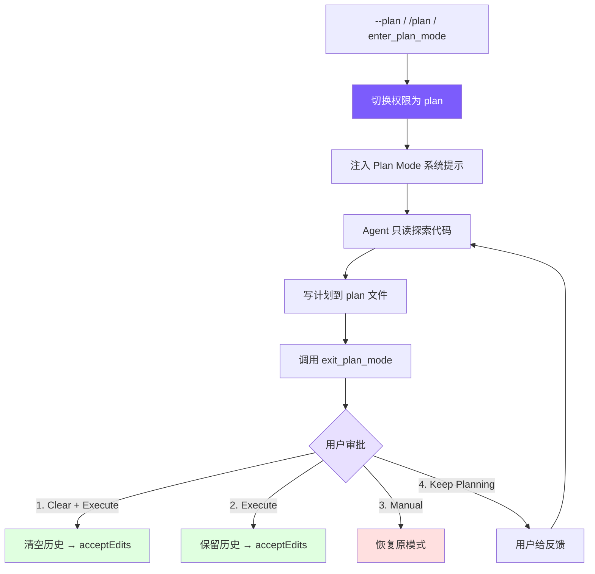

# 第 12 课：只读规划模式 (Plan Mode)

## 🎯 本节目标

为 Agent 实现 **Plan Mode (只读规划模式)**：使 Agent 在开始修改代码前，先进入只读沙箱状态探索代码结构、设计实现思路，并增量地将执行方案写入磁盘上的 plan 描述文件。在经用户交互审批后，切换回正常修改状态执行修改。这不仅可以减少盲目修改导致的 API 上下文爆栈，也能给用户提供明确的安全与方案确认机制。



---

## 🏆 最终效果

当学员完成本节课的代码实现后，可以运行：
```bash
mini-claude --plan "为当前项目添加一个新的辅助模块"
```

此时系统不会直接修改任何代码，而是触发以下交互流程：
1. **自动切换为 plan 权限**：系统提示 `[INFO] Entered plan mode. Plan file: <Home>/.claude/plans/plan-<sessionId>.md`
2. **只读运行与编写规划**：Agent 自主调用只读工具（如 `read_file`、`grep_search`）探索 codebase，并调用 `write_file`/`edit_file` 将设计规划增量写入专属的 `plan-<sessionId>.md`。任何非只读的写操作或 Shell 执行都会被底层拦截并报错提示 `Blocked in plan mode`。
3. **自主退出与四选项审批**：Agent 编写完成后自动调用 `exit_plan_mode`，控制台展示其制定的规划内容，并挂起等待用户从四个选项中输入进行审批：
   ```
     ==================================================
     PLAN FOR APPROVAL (plan-xxx.md)
     ==================================================
     # Plan Mode Active
     ...（规划内容）...

     Approval Options:
       1. Clear history and execute (Clear context + acceptEdits)
       2. Execute in current context (Keep context + acceptEdits)
       3. Execute manually (Keep context + normal manual approval)
       4. Keep planning (Provide feedback and continue editing plan)

     Enter choice (1-4): 
   ```
4. **决策分流执行**：如果用户选择 `1`，对话上下文历史会被清空以节省 Token 预算，系统切换回自动修改模式（`acceptEdits`），Agent 读取写在磁盘上的方案文件并高效地实施更改。

---

## 🛠️ 本节任务

- **任务 1**：在 `tools.py` 中定义 `enter_plan_mode` 和 `exit_plan_mode` 这对延迟加载工具的 Schema。
- **任务 2**：在 `tools.py` 的权限校验器 `check_permission` 中，为 `plan` 模式添加强制约束规则（只允许对 Plan 文件的写入，其余写入和 Shell 工具一律拦截）。
- **任务 3**：在 `agent.py` 的 `AgentState` 中，声明 Plan Mode 运行时所需的配置与状态字段，更新 `AgentState` 结构。
- **任务 4**：在 `agent.py` 中编写 `toggle_plan_mode` 权限/系统提示词切换逻辑，并编写 Plan Mode 激活时的专属系统提示词构造函数。
- **任务 5**：在 `agent.py` 中编写 `_execute_plan_mode_tool` 函数，处理进入与退出 Plan Mode 工具的底层实现（包含调用用户交互审批回调、清空对话历史等）。
- **任务 6**：在 `__main__.py` 中开发 CLI REPL 交互式的 4 选项审批交互，并将其作为回调函数注入到 Agent 实例中。

---

## 📦 涉及文件

修改：
- [tools.py](file:///e:/project/claude-code-from-scratch/tools.py)
- [agent.py](file:///e:/project/claude-code-from-scratch/agent.py)
- [__main__.py](file:///e:/project/claude-code-from-scratch/__main__.py)

---

## 🚀 开始实现

### 步骤 1：在 `tools.py` 中定义 Plan Mode 工具对

#### 为什么做
Plan Mode 的启动与终止是由大模型决策并驱动的。我们需要向模型暴露 `enter_plan_mode` 和 `exit_plan_mode` 工具，让模型明白“规划”也是一个可执行的控制流节点。

#### 做什么
打开 `tools.py`，在工具列表 `DEFINED_TOOLS` 中声明这两个工具。我们将它们标记为 `"deferred": True`（延迟加载），以便在常规对话中不占用宝贵的 Prompt 空间：

```python
# tools.py

    # 延迟加载工具：常规对话中不占用 Prompt 空间，需要时由 tool_search 唤醒
    {
        "name": "enter_plan_mode",
        "description": "Enter plan mode to switch to a read-only planning phase. In plan mode, you can only read files and write to the plan file.",
        "input_schema": {"type": "object", "properties": {}},
        "deferred": True,
    },
    {
        "name": "exit_plan_mode",
        "description": "Exit plan mode after you have finished writing your plan to the plan file.",
        "input_schema": {"type": "object", "properties": {}},
        "deferred": True,
    },
```

#### 注意什么
`deferred` 标记是由我们在第 3 章和第 4 章实现的工具延迟加载逻辑来处理的，大模型在需要时会先通过 `tool_search` 唤醒并获取它们的详细 Schema。

---

### 步骤 2：在 `check_permission` 中实施只读规则校验

#### 为什么做
System Prompt 只是引导，为了防御大模型在 `plan` 模式下“越轨”修改代码或运行 Shell 命令，我们需要在底层的权限控制器中实施硬性拦截，构筑安全的只读沙箱。

#### 做什么
修改 `tools.py` 中的 `check_permission` 函数，在开始拦截规则中加入 `mode == "plan"` 的校验。唯一的例外是：允许 Agent 修改 **Plan 方案文件本身**：

```python
# tools.py

def check_permission(
    tool_name: str,
    inp: dict,
    mode: str = "default",
    plan_file_path: str | None = None,
) -> dict:
    """校验工具调用权限，返回 {"action": "allow"|"deny"|"confirm", "message": ...}"""
    # 绕过模式：跳过所有权限检查
    if mode == "bypassPermissions":
        return {"action": "allow"}

    # 检查用户自定义的权限规则
    rule_result = _check_permission_rules(tool_name, inp)
    if rule_result == "deny":
        return {"action": "deny", "message": f"Denied by permission rule for {tool_name}"}
    if rule_result == "allow":
        return {"action": "allow"}

    # 1. 允许所有只读操作
    if tool_name in READ_TOOLS:
        return {"action": "allow"}

    # 2. 如果在 plan 模式下，实行严格沙箱限制
    if mode == "plan":
        if tool_name in EDIT_TOOLS:
            # 兼容不同的入参键名（file_path 或 path）
            file_path = inp.get("file_path") or inp.get("path")
            # 唯一例外：允许写入专属的 plan 文件
            if plan_file_path and file_path == plan_file_path:
                return {"action": "allow"}
            return {"action": "deny", "message": f"Blocked in plan mode: {tool_name}"}
        if tool_name == "run_shell":
            return {"action": "deny", "message": "Shell commands blocked in plan mode"}

    # 3. Plan Mode 工具本身允许执行切换
    if tool_name in ("enter_plan_mode", "exit_plan_mode"):
        return {"action": "allow"}

    if mode == "acceptEdits" and tool_name in EDIT_TOOLS:
        return {"action": "allow"}

    # ... 后续为 default/confirm 交互式权限逻辑
```

#### 注意什么
校验 `EDIT_TOOLS` 时，我们必须兼容不同的入参参数键名（有些工具入参是 `file_path`，有些是 `path`），所以在比对时使用了 `inp.get("file_path") or inp.get("path")`。

---

### 步骤 3：在 `agent.py` 中初始化 Plan Mode 状态字段

#### 为什么做
Plan Mode 的生命周期涉及跨轮对话的状态，例如：进入前的原始权限模式（以便退出后精确恢复）、Plan 文件的落盘路径、以及本次会话的历史上下文是否被用户清空过。

#### 做什么
打开 `agent.py`。在运行时状态类 `AgentState` 中，声明这三个关键字段：

```python
# agent.py

@dataclass
class AgentState:
    """Agent 实例的可变运行时状态。"""
    # ... 原有字段 ...
    # 记录进入 Plan 模式之前的权限状态，用于退出时精确恢复
    pre_plan_mode: str | None = None
    # 磁盘上 Plan Markdown 文件的绝对路径
    plan_file_path: str | None = None
    # 标识本会话是否为了节省 Token 而执行过上下文清空
    context_cleared: bool = False
```

同时，我们要在 `agent.py` 的 `Agent` 初始化构造阶段，判断如果启动配置中的 `permission_mode` 就是 `"plan"`，则立即计算并初始化好 Plan 路径并生成提示词：

```python
# agent.py -> Agent.__init__()

        # 如果启动时即为 plan 模式（如 --plan 参数），立即初始化 Plan 状态
        if self.config.permission_mode == "plan":
            self.state.plan_file_path = self._generate_plan_file_path()
            # 将 Plan Mode 专属提示词追加到基础 System Prompt 后
            self._system_prompt = self._base_system_prompt + self._build_plan_mode_prompt()
```

#### 注意什么
`pre_plan_mode` 极其重要，如果用户先是以 `--accept-edits` 启动，再切入切出 Plan Mode，我们应该恢复至 `acceptEdits` 而非回退到 `default`。

---

### 步骤 4：实现权限/系统提示词切换逻辑与提示词构造

#### 为什么做
进入 Plan Mode 时，我们需要动态地将专属的沙箱指引和磁盘 Plan 文件路径织入 System Prompt，并在此阶段对大模型下达不准擅自修改代码的终极指令。

#### 做什么
在 `agent.py` 中编写 `_generate_plan_file_path` 生成磁盘存储路径、`_build_plan_mode_prompt` 构造指引提示词，以及 `toggle_plan_mode` 状态切换函数：

```python
# agent.py

    def _generate_plan_file_path(self) -> str:
        """生成 Plan 文件的磁盘路径，存储在 ~/.claude/plans/ 目录下。"""
        d = Path.home() / ".claude" / "plans"
        d.mkdir(parents=True, exist_ok=True)
        return str(d / f"plan-{self.session_id}.md")

    def _build_plan_mode_prompt(self) -> str:
        """构建 Plan Mode 专属的 System Prompt 追加段落。

        包含只读沙箱指令、Plan 文件路径和工作流程指引。
        最后一行的 "Do NOT ask the user to approve" 是核心：
        防止模型用对话确认代替调用 exit_plan_mode 工具。
        """
        return f"""

# Plan Mode Active

Plan mode is active. You MUST NOT make any edits (except the plan file below), run non-readonly tools, or make any changes to the system.

## Plan File: {self.state.plan_file_path}
Write your plan incrementally to this file using write_file or edit_file. This is the ONLY file you are allowed to edit.

## Workflow
1. **Explore**: Read code to understand the task. Use read_file, list_files, grep_search.
2. **Design**: Design your implementation approach. Use the agent tool with type="plan" if the task is complex.
3. **Write Plan**: Write a structured plan to the plan file including:
   - **Context**: Why this change is needed
   - **Steps**: Implementation steps with critical file paths
   - **Verification**: How to test the changes
4. **Exit**: Call exit_plan_mode when your plan is ready for user review.

IMPORTANT: When your plan is complete, you MUST call exit_plan_mode. Do NOT ask the user to approve — exit_plan_mode handles that."""

    def toggle_plan_mode(self) -> str:
        """切换 Plan Mode 开关：进入时保存当前模式并激活只读，退出时恢复原模式。"""
        if self.config.permission_mode == "plan":
            # 退出 Plan Mode：恢复到进入前保存的权限模式
            self.config.permission_mode = self.state.pre_plan_mode or "default"
            self.state.pre_plan_mode = None
            self.state.plan_file_path = None
            # 还原基础 System Prompt，移除 Plan Mode 专属指令
            self._system_prompt = self._base_system_prompt
            self.history.update_system_prompt(self._system_prompt)
            print_info(f"Exited plan mode → {self.config.permission_mode} mode")
            return self.config.permission_mode
        else:
            # 进入 Plan Mode：保存当前模式并切换到只读
            self.state.pre_plan_mode = self.config.permission_mode
            self.config.permission_mode = "plan"
            self.state.plan_file_path = self._generate_plan_file_path()
            # 追加 Plan Mode 专属提示词到基础 System Prompt
            self._system_prompt = self._base_system_prompt + self._build_plan_mode_prompt()
            self.history.update_system_prompt(self._system_prompt)
            print_info(f"Entered plan mode. Plan file: {self.state.plan_file_path}")
            return "plan"
```

#### 注意什么
提示词的最后一行 `Do NOT ask the user to approve` 是核心精髓。大模型倾向于在写完方案后向用户对话确认“您觉得这个方案行吗？”，而不是调用工具。这句强制指令能确保它调用 `exit_plan_mode` 来唤起系统的审批流。

---

### 步骤 5：实现 Plan Mode 工具执行与用户审批流处理

#### 为什么做
当模型完成方案撰写并调用 `exit_plan_mode` 时，我们需要从磁盘中把 Plan 的 Markdown 内容读出来，通过外部注册的回调展示给用户，并根据用户的选择（1. 清空上下文，2. 保留上下文，3. 手动模式，4. 重新规划）来进行分流逻辑处理。

#### 做什么
在 `agent.py` 的 `_execute_plan_mode_tool` 中，完整实现进入与退出的一系列分支判定逻辑：

```python
# agent.py

    async def _execute_plan_mode_tool(self, name: str) -> str:
        """处理 enter_plan_mode 和 exit_plan_mode 工具的底层实现。"""
        if name == "enter_plan_mode":
            if self.config.permission_mode == "plan":
                return "Already in plan mode."
            # 保存当前权限模式，以便退出时恢复
            self.state.pre_plan_mode = self.config.permission_mode
            self.config.permission_mode = "plan"
            self.state.plan_file_path = self._generate_plan_file_path()
            self._system_prompt = self._base_system_prompt + self._build_plan_mode_prompt()
            self.history.update_system_prompt(self._system_prompt)
            print_info("Entered plan mode (read-only). Plan file: " + self.state.plan_file_path)
            return (
                f"Entered plan mode. You are now in read-only mode.\n\n"
                f"Your plan file: {self.state.plan_file_path}\n"
                f"Write your plan to this file. This is the only file you can edit.\n\n"
                f"When your plan is complete, call exit_plan_mode."
            )

        if name == "exit_plan_mode":
            if self.config.permission_mode != "plan":
                return "Not in plan mode."
            # 从磁盘读取 Plan 文件内容
            plan_content = "(No plan file found)"
            if self.state.plan_file_path and Path(self.state.plan_file_path).exists():
                plan_content = Path(self.state.plan_file_path).read_text()

            # 如果注册了外部审批回调函数（多在 REPL 等交互场景）
            if self._plan_approval_fn:
                result = await self._plan_approval_fn(plan_content)
                choice = result.get("choice", "manual-execute")

                if choice == "keep-planning":
                    # 用户给出反馈，要求继续修改 Plan
                    feedback = result.get("feedback") or "Please revise the plan."
                    return (
                        f"User rejected the plan and wants to keep planning.\n\n"
                        f"User feedback: {feedback}\n\n"
                        f"Please revise your plan based on this feedback. When done, call exit_plan_mode again."
                    )

                # 解析目标权限模式
                if choice == "clear-and-execute":
                    target_mode = "acceptEdits"
                elif choice == "execute":
                    target_mode = "acceptEdits"
                else:  # manual-execute 选项：恢复到进入 Plan 前的模式
                    target_mode = self.state.pre_plan_mode or "default"

                # 切换出只读模式，还原 System Prompt
                self.config.permission_mode = target_mode
                self.state.pre_plan_mode = None
                saved_plan_path = self.state.plan_file_path
                self.state.plan_file_path = None
                self._system_prompt = self._base_system_prompt
                self.history.update_system_prompt(self._system_prompt)

                if choice == "clear-and-execute":
                    # 清空对话历史以释放上下文空间，但保留 System Prompt
                    self.history.clear(keep_system=True)
                    self.state.context_cleared = True
                    print_info(f"Plan approved. Context cleared, executing in {target_mode} mode.")
                    # 将 Plan 内容作为提示喂回模型，防止"失忆"
                    return (
                        f"User approved the plan. Context was cleared. Permission mode: {target_mode}\n\n"
                        f"Plan file: {saved_plan_path}\n\n"
                        f"## Approved Plan:\n{plan_content}\n\n"
                        f"Proceed with implementation."
                    )

                print_info(f"Plan approved. Executing in {target_mode} mode.")
                return (
                    f"User approved the plan. Permission mode: {target_mode}\n\n"
                    f"## Approved Plan:\n{plan_content}\n\n"
                    f"Proceed with implementation."
                )

            # Fallback 分支（未设置审批回调，通常发生在子 Agent 场景）
            self.config.permission_mode = self.state.pre_plan_mode or "default"
            self.state.pre_plan_mode = None
            self.state.plan_file_path = None
            self._system_prompt = self._base_system_prompt
            self.history.update_system_prompt(self._system_prompt)
            print_info("Exited plan mode. Restored to " + self.config.permission_mode + " mode.")
            return f"Exited plan mode. Permission mode restored to: {self.config.permission_mode}\n\n## Your Plan:\n{plan_content}"

        return f"Unknown plan mode tool: {name}"
```

#### 注意什么
注意 `clear-and-execute` 分支：执行 `self.history.clear(keep_system=True)` 后，为了防止模型“失忆”不知道下一步该做什么，我们将先前在磁盘上读取好的 `Approved Plan` 作为提示喂回给模型，以便它带着这份计划快速且精准地恢复执行。

---

### 步骤 6：在入口端实现 CLI 审批交互与回调注入

#### 为什么做
控制台入口（REPL）是大模型与真实用户交互的核心。我们需要在命令行前端捕获退出工具触发的事件，提供友好的菜单选项并收集反馈，最终传回给 Agent 驱动内部状态机。

#### 做什么
打开 `__main__.py`。在 `run_repl` 入口函数中，定义 `plan_approval_fn` 回调逻辑，并通过 `set_plan_approval_fn` 绑定到 Agent 实例上：

```python
# __main__.py

    async def plan_approval_fn(plan_content: str) -> dict:
        """Plan 审批回调：展示 Plan 内容并收集用户选择。

        返回字典包含 choice（clear-and-execute/execute/manual-execute/keep-planning）
        和可选的 feedback（仅 keep-planning 时使用）。
        """
        print_plan_for_approval(plan_content)
        print_plan_approval_options()
        while True:
            try:
                choice = input("  Enter choice (1-4): ").strip()
            except EOFError:
                # 非交互式环境（管道/重定向）降级为手动模式
                return {"choice": "manual-execute"}

            if choice == "1":
                return {"choice": "clear-and-execute"}
            elif choice == "2":
                return {"choice": "execute"}
            elif choice == "3":
                return {"choice": "manual-execute"}
            elif choice == "4":
                try:
                    feedback = input("  Feedback (what to change): ").strip()
                except EOFError:
                    feedback = ""
                return {"choice": "keep-planning", "feedback": feedback or None}
            else:
                print("  Invalid choice. Enter 1, 2, 3, or 4.")

    # 将审批回调绑定到 Agent 实例
    agent.set_plan_approval_fn(plan_approval_fn)
```

#### 注意什么
为了提高在各类非交互式终端测试或重定向环境下的稳健性，我们在接收输入时用 `try...except EOFError` 包裹了 `input()`。当遇到 `EOFError` 时，系统将默认降级到 `"manual-execute"`（手动逐次校验模式），防止程序陷入死循环或崩溃。

---

## ⚖️ 设计权衡

### 方案 A：在磁盘生成 `.claude/plans/plan-{sessionId}.md`
* **优点**：
  1. 支持 `clear-and-execute`（清空上下文历史）工作流。哪怕当前内存对话链断开或为了节省 Token 将历史丢弃，Agent 依然能通过再次读取磁盘文件，找回完整的实现蓝图。
  2. 极佳的审计性：用户随时可以在外部编辑器或系统文件管理器中翻阅该规划，甚至在中断会话重新进入（`--resume`）时也保留历史凭证。
* **缺点**：
  * 需要进行本地文件 IO 操作和临时目录创建，在只读磁盘或容器隔离环境下可能遇到写入权限限制。

### 方案 B：纯内存维护 Plan 字符串
* **优点**：
  * 流程极其轻量，无需与操作系统文件系统发生交互，没有读写权限的隐患。
* **缺点**：
  * 一旦决定执行 `Clear + Execute` 动作，由于对话历史被彻底清空，写在上下文中的规划内容将无处可寻，Agent 无法在零历史状态下按计划展开实现。

### 结论
在 Coding Agent 的架构设计中，**“在磁盘持久化方案”是唯一的正解**。这既是维持 Agent 具备重组上下文（`clear-and-execute`）核心特征的基石，也能跨会话追溯历史。

---

## ⚠️ 常见陷阱

### 1. System Prompt 状态还原遗漏
* **陷阱**：在退出 Plan Mode 时，如果在把权限切回 `acceptEdits` 的同时，没有将模型的系统提示词从 `self._system_prompt` 中剔除，那么大模型仍会认为自己身处“只读规划”阶段，在执行时会不断提示“我不能修改代码”并再次调用 `exit_plan_mode`，陷入逻辑黑洞。
* **解决方案**：确保在 `toggle_plan_mode` 和 `_execute_plan_mode_tool` 的每一个退出分支中，将 `self._system_prompt` 精确重置为 `self._base_system_prompt`，并同步更新消息管道（`self.history.update_system_prompt`）。

### 2. 权限校验中的路径判定不精确
* **陷阱**：大模型可能会以相对路径（如 `../../.claude/plans/plan-xxx.md`）或包含环境变量的路径来请求工具。如果我们在 `check_permission` 中只进行简单的绝对路径字符串比对，可能会误判为非法路径进而予以拒绝，导致模型无法更新 Plan 方案。
* **解决方案**：在实际比对前，统一将获取到的路径解析为规范的绝对路径（在 Python 中通常使用 `Path(file_path).resolve()`）再进行判定。

---

## ✅ 验收点

### 1. 验证启动只读规划模式
* **输入命令**：
  ```bash
  mini-claude-py --plan "在当前目录创建一个 test_plan.py 并写入 print('plan ok')"
  ```
* **预期效果**：
  1. 控制台输出 `[INFO] Entered plan mode. Plan file: ...`
  2. 模型识别当前处于 Plan Mode，不调用普通文件写工具，而是自主读取已有代码。

### 2. 验证非 Plan 文件防写沙箱
* **输入**：故意命令大模型在规划阶段去修改项目已有的 `tools.py`。
* **预期效果**：底层的 `check_permission` 拦截非法编辑，并在调用时向模型返回以下阻断消息：
  ```json
  {"action": "deny", "message": "Blocked in plan mode: write_to_file"}
  ```
  大模型必须知难而退，返回文本说明受限于规划模式。

### 3. 验证 4 选项审批分流
* **输入**：当大模型完成规划并调用 `exit_plan_mode` 后，触发终端暂停。
* **验证流程**：
  1. 在控制台的 `Enter choice (1-4):` 提示下输入 `4` 并输入修改反馈（例如：“步骤2中请加上单元测试规划”），确认大模型返回规划阶段，并且其 Plan 文件的内容包含你的反馈。
  2. 再次退出时，输入 `1`（Clear + Execute）。
  3. 控制台打印 `[INFO] Plan approved. Context cleared...` 并开启清空历史后的自动修改流程。

---

## 🧠 思考题

1. **为什么在 Plan Approved 后更推荐使用 `1. Clear + Execute` 选项，而不是 `2. Execute`？**
   *(提示：这与 AI 编程中的 API 上下文长度、Token 花费以及大模型被历史对话干扰的注意力分散程度有关)*

2. **如果用户在使用 `4. Keep Planning` 时给出了极长、极复杂的改动反馈，大模型在再次进入规划阶段时，会不会面临上下文溢出？该如何防范？**

## 📦 本节收获

* **只读安全沙箱**：学会了如何通过动态切换权限模式，在底层拦截写操作和危险 Shell 执行。
* **解耦回调机制**：通过向 Agent 注入 `planApprovalFn` 回调函数，实现了底层模型调度逻辑与上层用户终端 UI（CLI/GUI）的彻底解耦。
* **上下文重整（Clear & Execute）**：理解了在复杂大型任务中，通过“方案写入磁盘持久化 -> 审批 -> 归零历史 -> 按照方案极简执行”来攻克上下文膨胀问题的架构设计。

---

> **下一章**：现在 Agent 具备了只读规划与自动恢复的执行能力。下一步我们将教导 Agent 如何防范死循环与消费失控——构建预算控制与成本管理系统。
