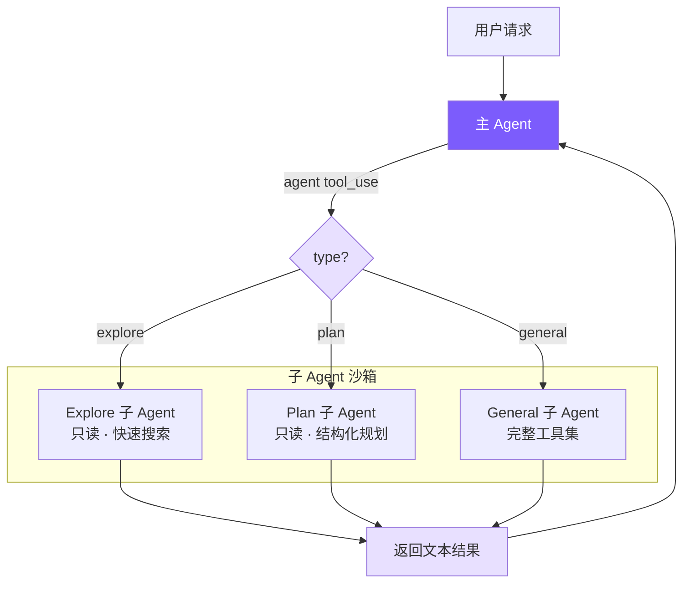

# 第 14 课：多 Agent 架构 (Multi-Agent)

## 🎯 本节目标

为 Agent 实现 **Sub-Agent（子代理）系统**：引入“分而治之”的设计思路。允许主 Agent 通过调用 `agent` 工具派生出相互隔离的子 Agent，去独立且并行地执行代码探索（`explore`）、方案设计（`plan`）或通用任务（`general`），并在完成后将结果汇总并返回给主 Agent。这能有效突破单次请求上下文窗口的限制，大幅提高处理超复杂工程任务的成功率。



---

## 🏆 最终效果

当学员完成本节课的代码实现后，可以尝试以下场景：

在大模型面对包含几十个复杂逻辑文件的重构任务时，它会自动在后台派生出 Explore 子代理。
在终端界面上，用户可以看到带有紫色专属边框的子代理运行标记：
```
  ┌─ Sub-agent [explore]: search config usages
  └─ Sub-agent [explore] completed
```
子代理在不污染主 Agent 历史上下文的前提下，快速且并发地执行代码扫描，并最终向主 Agent 汇报：“在以下 3 个文件中找到了配置引用：[...内容...]”。主 Agent 接收到这部分高度精炼的文本汇总后，在零废话的前提下直接展开精准编码。

---

## 🛠️ 本节任务

- **任务 1**：在 `subagent.py` 中定义内置子代理类型（`explore`、`plan`、`general`）的 System Prompt，并实现子代理配置加载函数 `get_sub_agent_config` 与项目级自定义代理扫描发现机制。
- **任务 2**：在 `tools.py` 中定义 `agent` 工具，支持传入任务描述、任务指令和代理类型参数。
- **任务 3**：在 `agent.py` 的构造函数中支持子代理相关的特殊参数（`custom_system_prompt`、`custom_tools`、`is_sub_agent`），并将其封装到 `AgentConfig`。
- **任务 4**：在 `agent.py` 中改造输出处理逻辑（引入 `self.state.output_buffer` 来捕获流式文本）并编写一次性运行接口 `run_once`。
- **任务 5**：在 `agent.py` 中编写子代理的执行方法 `_execute_agent_tool`，支持模型参数、`api_base` 参数继承、权限沙箱继承（`plan` 模式强制继承）以及 Token 消耗统计回传。

---

## 📦 涉及文件

修改或创建：
- [subagent.py](file:///e:/project/claude-code-from-scratch/subagent.py)
- [tools.py](file:///e:/project/claude-code-from-scratch/tools.py)
- [agent.py](file:///e:/project/claude-code-from-scratch/agent.py)

---

## 🚀 开始实现

### 步骤 1：在 `subagent.py` 中实现代理配置与自定义类型扫描

#### 为什么做
不同的子代理有不同的职责和安全约束。例如：`explore`（代码探索）和 `plan`（方案设计）代理绝对不允许修改任何代码文件，必须被剥夺所有的写操作权限；而 `general` 代理则可以拥有完整的写权限。此外，为了保证扩展性，我们还需要支持用户通过在 `.claude/agents/` 目录下放置 Markdown 配置文件来定义特定的自定义代理。

#### 做什么
创建或修改 `subagent.py`，实现内置 Prompt 模板定义、YAML Frontmatter 自定义代理加载逻辑，以及子代理工具集分配：

```python
# subagent.py

# 只读工具白名单：explore 和 plan 代理仅允许使用这些工具
READ_ONLY_TOOLS = {"read_file", "list_files", "grep_search"}

EXPLORE_PROMPT = """You are a file search specialist for Mini Claude Code. You excel at thoroughly navigating and exploring codebases.

=== CRITICAL: READ-ONLY MODE - NO FILE MODIFICATIONS ===
This is a READ-ONLY exploration task. You are STRICTLY PROHIBITED from:
- Creating new files (no write_file, touch, or file creation of any kind)
- Modifying existing files (no edit_file operations)
- Deleting files (no rm or deletion)
- Running ANY commands that change system state

Your role is EXCLUSIVELY to search and analyze existing code.
... (详细搜索指导词) ..."""

PLAN_PROMPT = """You are a Plan agent — a READ-ONLY sub-agent specialized for designing implementation plans.

IMPORTANT CONSTRAINTS:
- You are READ-ONLY. You only have access to read_file, list_files, and grep_search.
- Do NOT attempt to modify any files.
... (设计指导词) ..."""

GENERAL_PROMPT = """You are an agent for Mini Claude Code. Given the user's message, you should use the tools available to complete the task."""

# 扫描并加载本地/项目级自定义代理配置（从 ~/.claude/agents/ 和 .cwd()/.claude/agents/ 读取 Markdown）
def _discover_custom_agents() -> dict[str, dict]:
    # 扫描 ~/.claude/agents/ 和 .cwd()/.claude/agents/ 目录下的 Markdown
    # 复用 frontmatter 解析器并返回代理配置字典
    # ...
```

随后，编写 `get_sub_agent_config` 函数，为不同的代理分配其对应的系统提示词和经过过滤的工具列表：

```python
# subagent.py

# 根据代理类型返回对应的系统提示词和工具集
def get_sub_agent_config(agent_type: str) -> dict:
    """为指定类型的子代理分配 {system_prompt, tools}。"""
    # 优先检查用户自定义代理（通过 _discover_custom_agents 扫描）
    custom = _discover_custom_agents().get(agent_type)
    if custom:
        if custom["allowed_tools"]:
            tools = [t for t in tool_definitions if t["name"] in custom["allowed_tools"]]
        else:
            tools = [t for t in tool_definitions if t["name"] != "agent"]  # 排除递归派生，防止无限嵌套
        return {"system_prompt": custom["system_prompt"], "tools": tools}

    # 内置只读工具集（只允许读取与搜索，不允许写操作）
    read_only = [t for t in tool_definitions if t["name"] in READ_ONLY_TOOLS]

    if agent_type == "explore":
        return {"system_prompt": EXPLORE_PROMPT, "tools": read_only}
    elif agent_type == "plan":
        return {"system_prompt": PLAN_PROMPT, "tools": read_only}
    else:  # general
        # general 代理拥有完整工具集，但排除 agent 工具以防止递归创建子代理
        return {"system_prompt": GENERAL_PROMPT, "tools": [t for t in tool_definitions if t["name"] != "agent"]}
```

接下来，编写辅助函数用于生成可用代理类型的描述，并注入 System Prompt：

```python
# subagent.py

# 返回所有可用代理类型（内置 + 自定义）的名称与描述
def get_available_agent_types() -> list[dict[str, str]]:
    """返回所有可用代理类型（内置 + 自定义）的名称与描述。"""
    types = [
        {"name": "explore", "description": "Fast, read-only codebase search and exploration"},
        {"name": "plan", "description": "Read-only analysis with structured implementation plans"},
        {"name": "general", "description": "Full tools for independent tasks"},
    ]
    # 追加用户通过 .claude/agents/ 自定义的代理类型
    for name, defn in _discover_custom_agents().items():
        types.append({"name": name, "description": defn["description"]})
    return types


# 将自定义代理类型描述注入 System Prompt（仅在存在自定义代理时生成，避免冗余）
def build_agent_descriptions() -> str:
    """将自定义代理类型描述注入 System Prompt（仅当存在自定义代理时）。"""
    types = get_available_agent_types()
    if len(types) <= 3:
        return ""  # 仅有内置类型，已在 System Prompt 中硬编码，无需注入

    custom = types[3:]  # 跳过前 3 个内置类型
    lines = ["\n# Custom Agent Types", ""]
    for t in custom:
        lines.append(f"- **{t['name']}**: {t['description']}")
    return "\n".join(lines)
```

#### 注意什么

- **`get_available_agent_types` 的作用**：它将内置的三种代理类型与通过 `_discover_custom_agents()` 扫描到的用户自定义代理合并为统一列表，供外部查询。这使得 `agent` 工具的描述中可以动态展示当前可用的代理类型。
- **`build_agent_descriptions` 的条件注入**：仅当存在自定义代理时才返回描述文本，避免在只有内置代理的情况下向 System Prompt 注入冗余信息。
- **防止递归创建**：注意看 `GENERAL_PROMPT` 的工具分配：我们通过 `t["name"] != "agent"` 过滤掉了子代理创建自身的工具，这样能有效防止子代理无限制递归创建孙代理，从而避免 Token 的指数级消耗灾难。

---

### 步骤 2：在 `tools.py` 中定义 `agent` 工具

#### 为什么做
我们需要让主 Agent 知道它可以调用一个名为 `agent` 的工具。当大模型面对较繁重或需要独立探索的任务时，它会输出结构化的 `agent` 工具调用入参。

#### 做什么
打开 `tools.py`。在 `DEFINED_TOOLS` 列表中注册 `agent` 工具 Schema：

```python
# tools.py

    # agent 工具：允许主 Agent 派生子代理处理独立任务
    {
        "name": "agent",
        "description": "Launch a sub-agent to handle a task autonomously. Sub-agents have isolated context and return their result. Types: 'explore' (read-only), 'plan' (read-only, structured planning), 'general' (full tools).",
        "input_schema": {
            "type": "object",
            "properties": {
                "description": {"type": "string", "description": "Short (3-5 word) description of the sub-agent's task"},
                "prompt": {"type": "string", "description": "Detailed task instructions for the sub-agent"},
                "type": {"type": "string", "enum": ["explore", "plan", "general"], "description": "Agent type. Default: general"},
            },
            "required": ["description", "prompt"],
        },
    },
```

#### 注意什么
子代理的 `type` 我们给出了 `explore` / `plan` / `general` 选项，让主大模型可以根据任务性质动态决策需要启动何种级别的沙箱。

---

### 步骤 3：改造 `Agent` 构造器以支持子代理参数

#### 为什么做
子代理本质上就是主 `Agent` 类的一个新实例，但它使用了定制的 System Prompt 和经过裁剪的工具集。我们需要让 `Agent` 的初始化构造函数能够无缝容纳这些外部覆盖变量。

#### 做什么
打开 `agent.py`。修改 `Agent` 类的 `__init__` 函数，添加并处理子代理所需变量：

```python
# agent.py

    def __init__(
        self,
        *,
        permission_mode: PermissionMode = "default",
        model: str = "claude-opus-4-6",
        api_base: str | None = None,
        anthropic_base_url: str | None = None,
        api_key: str | None = None,
        thinking: bool = False,
        max_cost_usd: float | None = None,
        max_turns: int | None = None,
        confirm_fn: Callable[[str], Awaitable[bool]] | None = None,
        custom_system_prompt: str | None = None,   # 子代理自定义系统提示词
        custom_tools: list[ToolDef] | None = None,  # 子代理裁剪后的工具集
        is_sub_agent: bool = False,                  # 标识是否为子代理（影响输出捕获与 MCP 初始化）
    ):
        # 封装至统一的 AgentConfig 中
        self.config = AgentConfig(
            permission_mode=permission_mode,
            model=model,
            api_base=api_base,
            anthropic_base_url=anthropic_base_url,
            api_key=api_key,
            thinking=thinking,
            max_cost_usd=max_cost_usd,
            max_turns=max_turns,
            custom_system_prompt=custom_system_prompt,
            custom_tools=custom_tools,
            is_sub_agent=is_sub_agent,
        )
        
        self.state = AgentState()
        # ... 其它初始化 ...

        # 子代理覆写工具列表与系统提示词，主 Agent 使用默认值
        self.tools = custom_tools or tool_definitions
        self._base_system_prompt = custom_system_prompt or build_system_prompt()
```

并在 `Agent` 类中声明 `is_sub_agent` 只读属性：

```python
# agent.py

    # 只读属性：不可直接赋值，需通过 self.config 存储
    @property
    def is_sub_agent(self) -> bool:
        return self.config.is_sub_agent
```

#### 注意什么
不要直接给 `self.is_sub_agent` 赋值（如 `self.is_sub_agent = is_sub_agent`），因为它是只读属性。我们应当将其存储在 `self.config` 中。

---

### 步骤 4：流式输出捕获与一次性运行接口设计

#### 为什么做
主 Agent 需要获取子 Agent 所有的文字分析总结。因此，子 Agent 运行时产生的流式文本不能像主 Agent 那样直接打到控制台，而是需要拦截并拼接收集到一个字符串缓冲区（`output_buffer`）中，在运行结束后打包带回给主 Agent。

#### 做什么
1. **修改输出拦截器**：修改 `agent.py` 的 `_emit_text` 输出管道函数。当检测到 `output_buffer` 激活时，将文本追加至缓冲区，否则直接打印：

```python
# agent.py

    # 输出拦截器：子代理运行时将文本写入缓冲区，主 Agent 直接打印
    def _emit_text(self, text: str) -> None:
        if self.state.output_buffer is not None:
            self.state.output_buffer.append(text)   # 子代理：捕获流式文本供后续回传
        else:
            print_assistant_text(text)               # 主 Agent：直接输出到控制台
```

2. **实现 `run_once` 执行入口**：在 `Agent` 中编写子代理单次生命周期内的执行控制逻辑，运行结束后计算消耗的 Token 并返回缓冲区文本：

```python
# agent.py

    # 子代理一次性运行接口：激活缓冲区 -> 执行 chat -> 收集输出与 Token 消耗
    async def run_once(self, prompt: str) -> dict:
        self.state.output_buffer = []  # 激活文本捕获缓冲区，子代理的流式输出不再打印到控制台
        # 记录运行前的 Token 数，用于计算本次运行的消耗增量
        prev_in = self.state.total_input_tokens
        prev_out = self.state.total_output_tokens
        
        await self.chat(prompt)  # 运行标准的 chat 会话逻辑
        
        text = "".join(self.state.output_buffer)  # 将缓冲区中的流式片段拼接为完整文本
        self.state.output_buffer = None  # 关闭缓冲区，恢复主 Agent 的直接打印行为
        
        # 返回捕获的完整文本与产生的 Token 消耗增量（增量计算，而非绝对值）
        return {
            "text": text,
            "tokens": {
                "input": self.state.total_input_tokens - prev_in,
                "output": self.state.total_output_tokens - prev_out,
            },
        }
```

#### 注意什么
Token 消耗要使用增量计算（`self.state.total_input_tokens - prev_in`），因为即使在单次运行中，大模型可能也会经历多轮工具调用，我们需要捕获这段生命周期内产生的所有 Token 开销并加总。

---

### 步骤 5：实现子代理的执行与权限继承逻辑

#### 为什么做
当主大模型选择调用 `agent` 工具时，我们需要根据大模型传入的 `agent_type` 获取对应的 Prompt 和工具集、实例化子代理，并驱动其运行。为了防止安全越权，子代理必须精准继承父代理的特定权限（尤其是 Plan Mode 状态下的只读约束）。

#### 做什么
1. **编写 `_execute_agent_tool` 方法**：在 `agent.py` 中，实现子代理的实例化、API 继承、执行驱动以及 Token 统计结算：

```python
# agent.py

    # 子代理执行入口：根据类型获取配置 -> 实例化 -> 运行 -> 合并 Token 账单
    async def _execute_agent_tool(self, inp: dict) -> str:
        agent_type = inp.get("type", "general")
        description = inp.get("description", "sub-agent task")
        prompt = inp.get("prompt", "")

        print_sub_agent_start(agent_type, description)  # 紫色边框标记子代理启动

        config = get_sub_agent_config(agent_type)
        sub_agent = Agent(
            model=self.config.model,
            # 继承父 Agent 的 API 后端地址（如 aihubmix 中转），否则子代理会路由到默认 Anthropic 端点
            api_base=str(self._openai_client.base_url) if self.use_openai and self._openai_client else None,
            anthropic_base_url=str(self._anthropic_client.base_url) if not self.use_openai and self._anthropic_client else None,
            custom_system_prompt=config["system_prompt"],
            custom_tools=config["tools"],
            is_sub_agent=True,
            # 权限继承：父级处于 plan 模式时，子级强制继承只读约束；否则放行以支持子代理自主执行
            permission_mode="plan" if self.config.permission_mode == "plan" else "bypassPermissions",
        )

        try:
            result = await sub_agent.run_once(prompt)
            # 将子代理消耗的 Token 累加到主代理账单中，实现统一计费
            self.state.total_input_tokens += result["tokens"]["input"]
            self.state.total_output_tokens += result["tokens"]["output"]
            print_sub_agent_end(agent_type, description)
            return result["text"] or "(Sub-agent produced no output)"
        except Exception as e:
            logger.error(f"Sub-agent error: {e}")
            print_sub_agent_end(agent_type, description)
            return f"Sub-agent error: {e}"
```

2. **在工具分发器中注册该工具处理流程**：

```python
# agent.py -> _execute_tool_call()

        # 工具分发器：拦截 agent 工具调用，路由至子代理执行
        if name == "agent":
            return await self._execute_agent_tool(inp)
```

同时，我们还要在 `Agent` 内部对流式输出结束的自动保存、账单显示等模块加装 `if not self.config.is_sub_agent` 的卫语句拦截，防止子代理的中间执行干扰主 REPL 的输出。

#### 注意什么
`api_base` 继承是跨后端（OpenAI 兼容平台）执行时的生命线。一旦遗漏该参数，子代理会盲目向默认的 Anthropic 端发起请求，导致 API Key 不匹配报错。此外，`permission_mode` 的计划模式继承在安全性上也极其关键。

---

## ⚖️ 设计权衡

### 方案 A：Fork-Return 派生子代理模式（本节采用）
* **优点**：
  1. 上下文天然隔离：主子代理使用完全独立的对话历史（`MessageHistory` 实例），防止代码探索的大文本数据污染主上下文导致主模型“健忘”或爆栈。
  2. 极佳的容错性：子代理发生任何编译或网络报错都会被主 Agent 捕获并转为错误文本。主模型可以根据报错自主决定重新委派或是换用其他方法。
* **缺点**：
  * 主子代理之间无法实现无缝的“交互式聊天”，必须通过明确的 Prompt 和 Tool Use 任务指派来交换信息。

### 方案 B：全局 Worker 进程隔离与信箱对等协作模式
* **优点**：
  * 支持多 Agent 并行同时修改多个文件，效率极高，适合超大工程协作。
* **缺点**：
  * 架构及其繁重，需要实现跨进程调度、文件锁与冲突合并，以及复杂的异步信箱机制，对于轻量 Coding Agent 而言开发成本和运行时负担过大。

---

## ⚠️ 常见陷阱

### 1. 只读属性 `is_sub_agent` 的赋值错误
* **陷阱**：如果在子代理的构造阶段，直接尝试使用 `self.is_sub_agent = True` 进行状态标识，Python 会抛出 `AttributeError: can't set attribute` 错误导致初始化失败。
* **解决方案**：记住在 Python 中带有 `@property` 装饰器的函数都是只读的。我们必须将真实状态存储在 `self.config` 中，并在 property 函数中通过 `return self.config.is_sub_agent` 来提供读取接口。

### 2. 子代理未继承 `api_base`
* **陷阱**：如果学员在实现子代理实例化时，遗漏了 `api_base` 的透传，当用户通过中转节点（如 `aihubmix.com`）使用自定义 OpenAI 后端运行 `mini-claude` 时，子代理在后台会被直接路由至官方向外请求，导致服务阻断。
* **解决方案**：实例化时务必增加以下继承：`api_base=str(self._openai_client.base_url) if self.use_openai else None`。

---

## ✅ 验收点

### 1. 验证内置只读子代理启动
* **输入指令**：
  ```bash
  mini-claude-py "我想修改 tools.py 中的一个注释。在此之前，请先用 explore 子代理在 python 目录搜索 tools.py，看看它目前有哪些工具定义"
  ```
* **预期效果**：
  1. 控制台流式输出中，会显示带紫色边框的 `┌─ Sub-agent [explore]: search tools.py` 字样。
  2. 子代理只读运行，通过 `grep_search` 获取结果后关闭并输出 `Sub-agent completed`。
  3. 主代理汇总信息并给用户呈现最终结果。

### 2. 验证子代理写操作拦截
* **测试用例**：
  给子代理发送任务，明确要求其修改某个代码文件，例如：“用 general 子代理修改 README.md 文件并追加一句话”。
* **预期效果**：
  1. 如果指定启动的是 `explore` 或 `plan` 类型的子代理，底层的写操作在权限阶段直接被物理拦截，向模型返回只读错误。
  2. 主代理获得子代理返回的“操作被拒绝”的错误信息，并向用户报告任务失败及原因。

---

## 🧠 思考题

1. **如果在 Plan Mode (规划模式) 下，用户批准了清空历史并执行（Clear + Execute），此时主 Agent 派生出的通用子 Agent（General Sub-Agent），能不能绕过只读限制去修改代码？**
   *(提示：关注 `permission_mode="plan" if self.config.permission_mode == "plan" else "bypassPermissions"` 这一行逻辑)*

2. **为什么在 `subagent.py` 的 `get_sub_agent_config` 函数中，我们从 `general` 代理的可用工具集中特意排除了 `agent` 工具？如果不排除，可能会发生什么？**

---

## 📦 本节收获

* **Fork-Return 控制流**：学会了如何在同一个类（`Agent`）下通过属性覆盖和输出拦截实现快速的轻量级子进程分叉与回收。
* **隔离上下文**：理解了在复杂工程项目中，利用子代理实现“局部信息探索 -> 文本摘要提炼 -> 回传主模型”来节省核心上下文空间的高级玩法。
* **安全沙箱继承**：掌握了在多级智能体系统下，如何通过传递配置项在子智能体中延续父智能体的安全与只读限制。

---

> **下一章**：现在 Agent 具备了独立派生并隔离控制子代理的能力。下一步我们将扩展其工具使用边界，使 Agent 无需修改源码便能连接外部的丰富服务生态——构建基于 Stdio 的 MCP（Model Context Protocol）连接客户端。
