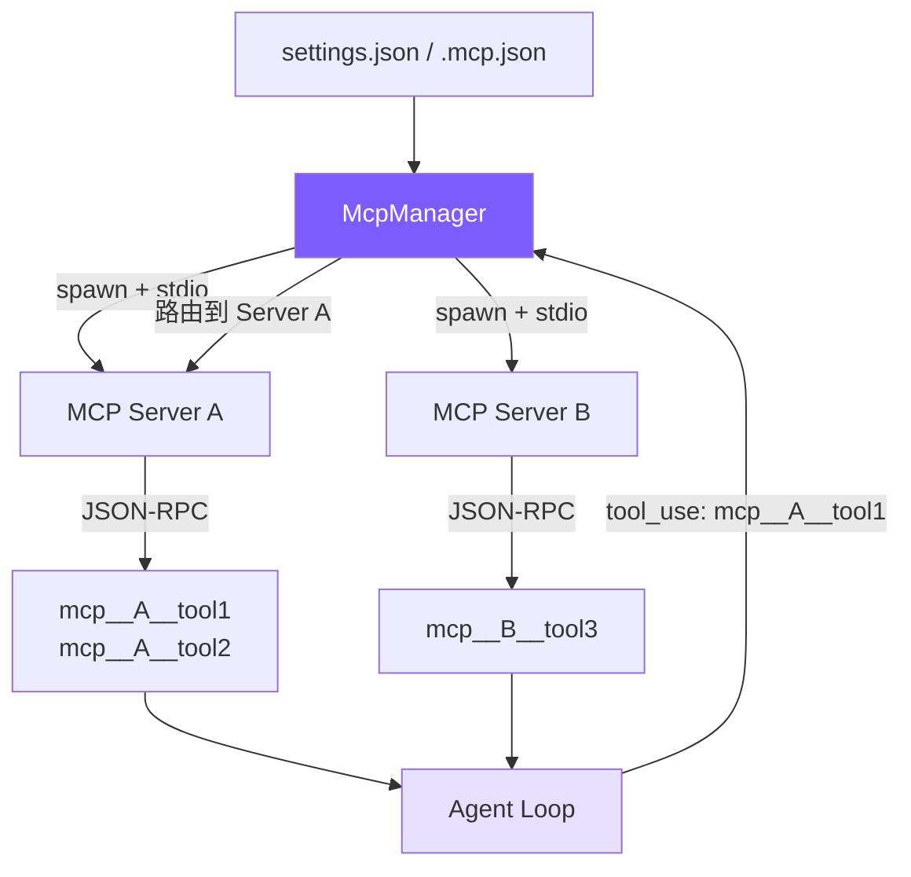

# 第 15 课：MCP 集成 (Model Context Protocol)

## 🎯 本节目标

为 Agent 实现 **MCP（Model Context Protocol，模型上下文协议）客户端**：MCP 是 Anthropic 推出的开放协议。通过该协议，Agent 无需修改底层源码，便能通过外部工具服务器（MCP Server）动态连接各种第三方服务（如本地文件系统、SQLite 数据库、GitHub、Slack 等）。我们将不依赖任何外部 SDK，直接利用 Python 底层子进程与标准 JSON-RPC 协议手写一个 stdio 传输通道，实现配置加载、握手协商、工具自动发现与运行时透明路由分发。



---

## 🏆 最终效果

完成本节课的开发后，学员可以配置一个本地文件系统 MCP 服务来进行测试。

### 1. 声明服务器配置文件
在当前项目根目录创建 `.mcp.json`：
```json
{
  "mcpServers": {
    "filesystem": {
      "command": "npx",
      "args": ["-y", "@modelcontextprotocol/server-filesystem", "e:/project/claude-code-from-scratch/test"]
    }
  }
}
```

### 2. 自动建立连接与发现工具
启动 `mini-claude-py` 时，控制台打印出握手与工具加载信息：
```
[mcp] Connected to 'filesystem' — 9 tools
  Mini Claude Code — A minimal coding agent
> 
```

### 3. 透明调用外部工具
向大模型发送请求：“读取 test 目录下的 sample.txt 文件”。
主大模型在后台会翻译为以下调用：
```
[mcp__filesystem__read_file] { "path": "e:/project/claude-code-from-scratch/test/sample.txt" }
```
`McpManager` 拦截调用，并将其转化为标准 JSON-RPC 消息经 `stdio` 管道发往 `filesystem` 进程。子进程执行后返回文本，Agent 成功读取并呈现给用户。对于主 Agent 逻辑来说，MCP 工具与内置工具无任何使用差异。

---

## 🛠️ 本节任务

- **任务 1**：在 `mcp_client.py` 中编写 `McpConnection` 类，利用 `asyncio.create_subprocess_exec` 派生服务器子进程，并设计 `asyncio.Future` 实现双向 JSON-RPC 的请求与响应配对机制。
- **任务 2**：在 `McpConnection` 中编写初始化握手 `initialize`、获取工具列表 `list_tools` 以及工具执行调用 `call_tool` 方法。
- **任务 3**：在 `mcp_client.py` 中编写 `McpManager` 类，负责合并读取多路径的 settings/mcp 配置，并提供路由派发 `call_tool` 与工具前缀注册功能。
- **任务 4**：在 `agent.py` 的初始化阶段声明 `McpManager` 实例，并在首次 `chat` 消息进入时进行**延迟懒加载**连接与工具发现。
- **任务 5**：在 `agent.py` 的 `_execute_tool_call` 工具分发逻辑中，拦截 `mcp__` 前缀的工具调用并路由至 `McpManager` 进行执行。

---

## 📦 涉及文件

修改或创建：
- [mcp_client.py](file:///e:/project/claude-code-from-scratch/mcp_client.py)
- [agent.py](file:///e:/project/claude-code-from-scratch/agent.py)

---

## 🚀 开始实现

### 步骤 1：利用 `asyncio.subprocess` 实现 `McpConnection` 子进程管道与消息配对

#### 为什么做
stdio 模式是 MCP 协议最通用的传输机制。我们需要 spawn 外部进程，通过往子进程的 `stdin` 管道写入单行 JSON 字符串发起调用，并在后台用异步循环不间断读取 `stdout` 输出行。
由于请求与响应在 stdio 流中是异步交错的，我们需要使用一个自增 id 与 Python `asyncio.Future` 对象组合，在收到响应行时精确 resolve 挂起的请求。

#### 做什么
创建 [mcp_client.py](file:///e:/project/claude-code-from-scratch/mcp_client.py)，编写子进程管道建立与 JSON-RPC 消息后台读取循环：

```python
# mcp_client.py

import asyncio
import json
import os
import subprocess
from pathlib import Path
from typing import Any

class McpConnection:
    """管理单个 MCP 服务器子进程及 stdio 上的 JSON-RPC 通信。"""

    def __init__(self, server_name: str, command: str, args: list[str] | None = None,
                 env: dict[str, str] | None = None):
        self.server_name = server_name          # 服务器名称（用于日志和前缀路由）
        self.command = command                  # 启动命令（如 "npx"）
        self.args = args or []                  # 命令行参数
        self.env = env or {}                    # 额外的环境变量
        self._process: asyncio.subprocess.Process | None = None
        self._next_id = 1                       # 自增请求 ID，用于配对请求与响应
        self._pending: dict[int, asyncio.Future] = {}  # 挂起的请求 id -> Future（用于异步等待响应）
        self._reader_task: asyncio.Task | None = None   # 后台读取 stdout 的异步任务

    # 派生子进程并启动后台读取循环，建立 stdio 双向通信管道
    async def connect(self) -> None:
        """派生服务器子进程并监听其输出。"""
        merged_env = {**os.environ, **self.env}
        self._process = await asyncio.create_subprocess_exec(
            self.command, *self.args,
            stdin=subprocess.PIPE,    # 用于写入 JSON-RPC 请求
            stdout=subprocess.PIPE,   # 用于读取 JSON-RPC 响应
            stderr=subprocess.PIPE,
            env=merged_env,
        )
        # 后台协程持续消费 stdout 缓冲区，防止管道死锁
        self._reader_task = asyncio.create_task(self._read_loop())

    # 后台异步循环：按行读取 stdout 并根据 id 匹配挂起的 Future
    async def _read_loop(self) -> None:
        """后台异步循环：按行解析 stdio 返回并激活 Future。"""
        assert self._process and self._process.stdout
        while True:
            line = await self._process.stdout.readline()
            if not line:
                break  # 子进程关闭 stdout，退出循环
            try:
                msg = json.loads(line)
            except json.JSONDecodeError:
                continue  # 非 JSON 行直接忽略（如子进程的 stderr 混入 stdout）
            
            # 根据响应中的 id 找到对应的挂起请求并 resolve
            msg_id = msg.get("id")
            if msg_id is not None and msg_id in self._pending:
                fut = self._pending.pop(msg_id)
                if "error" in msg:
                    e = msg["error"]
                    fut.set_exception(
                        RuntimeError(f"MCP error {e.get('code')}: {e.get('message')}")
                    )
                else:
                    fut.set_result(msg.get("result"))

    # 发送带 id 的 JSON-RPC 请求，挂起当前协程等待 Future 被 resolve
    async def _send_request(self, method: str, params: dict | None = None) -> Any:
        """发送 JSON-RPC 请求并挂起协程等待响应。"""
        assert self._process and self._process.stdin
        req_id = self._next_id
        self._next_id += 1  # 自增 ID 保证每次请求唯一
        msg = json.dumps({"jsonrpc": "2.0", "id": req_id, "method": method, "params": params or {}})
        # 必须添加换行符，因为子进程按行（readline）解析
        self._process.stdin.write((msg + "\n").encode())
        await self._process.stdin.drain()  # 等待缓冲区写入完成，防止管道阻塞
        
        loop = asyncio.get_event_loop()
        fut: asyncio.Future = loop.create_future()
        self._pending[req_id] = fut  # 注册 Future，等待 _read_loop 中 resolve
        return await fut

    # 发送 JSON-RPC 通知（无 id 字段），不期望服务端响应
    def _send_notification(self, method: str, params: dict | None = None) -> None:
        """发送 JSON-RPC 通知消息（无 id，不期望响应）。"""
        if not self._process or not self._process.stdin:
            return
        msg = json.dumps({"jsonrpc": "2.0", "method": method, "params": params or {}})
        self._process.stdin.write((msg + "\n").encode())
```

#### 注意什么
`stdin.write` 后面必须增加 `(msg + "\n").encode()` 并调用 `await stdin.drain()`。因为子进程是按行（readline）解析的，如果没有换行符，子进程会一直处于等待输入的阻塞状态，导致请求超时挂起。

---

### 步骤 2：在 `McpConnection` 中编写初始化握手与发现调用逻辑

#### 为什么做
MCP 协议是标准的客户端/服务端结构。连接建立后，我们首先要完成握手流程：发送 `initialize` 协商协议版本，并紧接着发送 `notifications/initialized` 通知告诉服务端连接成功；随后通过 `tools/list` 获取服务端提供的工具 Schema，并封装工具执行调用函数。

#### 做什么
在 `McpConnection` 中编写握手协议、工具发现与远程调用的具体实现：

```python
# mcp_client.py -> McpConnection 内部

    # MCP 协议初始化握手：发送 initialize 请求 -> 等待响应 -> 发送 initialized 通知
    async def initialize(self) -> None:
        """完成 MCP 协议初始化握手。"""
        await self._send_request("initialize", {
            "protocolVersion": "2024-11-05",   # MCP 协议版本号
            "capabilities": {},                 # 客户端能力声明（当前为空）
            "clientInfo": {"name": "mini-claude", "version": "1.0.0"},
        })
        # 握手成功后必须发送通知以完成最终确认（某些严格遵照协议的服务器会拒绝未确认的请求）
        self._send_notification("notifications/initialized")

    # 向服务端请求工具列表，返回标准化的工具 Schema
    async def list_tools(self) -> list[dict]:
        """向服务端请求发现所有可用工具 Schema。"""
        result = await self._send_request("tools/list")
        if not result or not isinstance(result.get("tools"), list):
            return []
        # 为每个工具附加 serverName，用于后续的前缀路由
        return [
            {
                "name": t["name"],
                "description": t.get("description", ""),
                "inputSchema": t.get("inputSchema"),
                "serverName": self.server_name,
            }
            for t in result["tools"]
        ]

    # 调用远程 MCP 工具，只提取文本类型结果（过滤掉图片等非文本内容）
    async def call_tool(self, name: str, args: dict) -> str:
        """路由调用远程工具，并提取其中的 text 内容返回。"""
        result = await self._send_request("tools/call", {"name": name, "arguments": args})
        if isinstance(result, dict) and isinstance(result.get("content"), list):
            # MCP 工具可能返回图片等多媒体内容，只拼接文本块避免乱码
            return "\n".join(
                c["text"] for c in result["content"] if c.get("type") == "text"
            )
        return json.dumps(result)

    # 关闭子进程并清理所有挂起的 Future，防止资源泄漏
    def close(self) -> None:
        """关闭子进程，释放连接资源。"""
        if self._reader_task:
            self._reader_task.cancel()
            self._reader_task = None
        if self._process:
            try:
                self._process.kill()
            except ProcessLookupError:
                pass  # 进程已退出，忽略
            self._process = None
        # 将所有挂起等待响应的 Futures 异常 reject，防止协程永久挂起
        for fut in self._pending.values():
            if not fut.done():
                fut.set_exception(RuntimeError(f"MCP server '{self.server_name}' closed"))
        self._pending.clear()
```

#### 注意什么
在 `call_tool` 的数据提取中，我们使用了 `c["text"] for c in result["content"] if c.get("type") == "text"`。这是因为 MCP 工具执行可能会返回包含多媒体、图片、文件等复杂格式的数据块，为了防止 Agent 收到乱码或无法理解的流，我们只提取文本类型进行拼接。

---

### 步骤 3：编写 `McpManager` 统一管理器与多路径配置合并

#### 为什么做
用户可能会同时在多个地方配置不同的服务器（用户级的全局配置 `~/.claude/settings.json`、项目级的 `.claude/settings.json` 以及 `.mcp.json`）。我们需要在启动时，依次读取这些路径并将它们合并（同名服务器后读覆盖先读），为每个服务器建立 `McpConnection` 连接，并将发现的工具名统一添加 `mcp__serverName__toolName` 前缀返回，从而规避命名冲突并嵌入路由信息。

#### 做什么
在 `mcp_client.py` 中编写 `McpManager` 类：

```python
# mcp_client.py

class McpManager:
    """管理所有配置的 MCP 服务生命周期与工具分发路由。"""

    def __init__(self):
        self._connections: dict[str, McpConnection] = {}  # 服务器名 -> 连接实例
        self._tools: list[dict] = []                      # 所有服务器发现的工具列表
        self._connected = False                           # 防止重复连接的标志

    # 加载配置 -> 建立连接 -> 发现工具（仅执行一次）
    async def load_and_connect(self) -> None:
        """解析并合并多地配置文件，异步启动每个服务器的连接并发现工具。"""
        if self._connected:
            return  # 幂等：已连接则跳过
        self._connected = True

        configs = self._load_configs()
        if not configs:
            return

        timeout = 15.0  # 握手超时：防御 npx 首次下载卡死

        for name, cfg in configs.items():
            conn = McpConnection(name, cfg["command"], cfg.get("args"), cfg.get("env"))
            try:
                await conn.connect()
                # 使用 wait_for 控制握手与发现超时，防止网络不稳定导致启动卡死
                await asyncio.wait_for(conn.initialize(), timeout=timeout)
                server_tools = await asyncio.wait_for(conn.list_tools(), timeout=timeout)
                self._connections[name] = conn
                self._tools.extend(server_tools)
                print(f"[mcp] Connected to '{name}' — {len(server_tools)} tools", flush=True)
            except Exception as e:
                print(f"[mcp] Failed to connect to '{name}': {e}", flush=True)
                conn.close()  # 连接失败时释放已创建的子进程

    # 将原始工具列表转换为带 mcp__ 前缀的标准 Anthropic schema
    def get_tool_definitions(self) -> list[dict]:
        """将发现的工具包装为 mcp__ 前缀形式，并返回标准的 Anthropic schema 定义。"""
        return [
            {
                "name": f"mcp__{t['serverName']}__{t['name']}",  # 三段式命名：mcp__服务器__工具
                "description": t.get("description") or f"MCP tool {t['name']} from {t['serverName']}",
                "input_schema": t.get("inputSchema") or {"type": "object", "properties": {}},
            }
            for t in self._tools
        ]

    # 判断工具名是否为 MCP 外部工具（通过前缀识别）
    def is_mcp_tool(self, name: str) -> bool:
        return name.startswith("mcp__")

    # 从三段式前缀名中解析出服务器名和工具名，路由到对应的连接执行
    async def call_tool(self, prefixed_name: str, args: dict) -> str:
        """从三段式前缀工具名中拆分出服务器与工具名，分发执行。"""
        parts = prefixed_name.split("__")
        if len(parts) < 3:
            raise ValueError(f"Invalid MCP tool name: {prefixed_name}")
        server_name = parts[1]
        tool_name = "__".join(parts[2:])  # 工具名本身可能包含 __，因此取剩余部分拼接
        conn = self._connections.get(server_name)
        if not conn:
            raise RuntimeError(f"MCP server '{server_name}' not connected")
        return await conn.call_tool(tool_name, args)

    # 关闭所有子进程连接并重置状态
    async def disconnect_all(self) -> None:
        for conn in self._connections.values():
            conn.close()
        self._connections.clear()
        self._tools.clear()
        self._connected = False

    # 按优先级合并多路径配置文件（后读覆盖先读）
    def _load_configs(self) -> dict[str, dict]:
        """合并多路径配置文件。"""
        merged: dict[str, dict] = {}
        self._merge_config_file(Path.home() / ".claude" / "settings.json", merged)   # 全局配置（最低优先级）
        self._merge_config_file(Path.cwd() / ".claude" / "settings.json", merged)    # 项目级配置
        self._merge_config_file(Path.cwd() / ".mcp.json", merged)                    # .mcp.json（最高优先级）
        return merged

    # 读取单个配置文件并合并到目标字典
    def _merge_config_file(self, path: Path, target: dict[str, dict]) -> None:
        if not path.exists():
            return
        try:
            raw = json.loads(path.read_text(encoding="utf-8"))
            # 兼容 settings.json 的 mcpServers 结构和 .mcp.json 的扁平结构
            servers = raw.get("mcpServers", raw)
            for name, config in servers.items():
                if isinstance(config, dict) and "command" in config:
                    target[name] = config  # 后读的同名服务器覆盖先读的
        except Exception:
            pass  # 配置解析失败时静默跳过，不阻断启动
```

#### 注意什么
在连接时，我们为握手与加载外加了 `asyncio.wait_for` 超限机制。这是因为很多 MCP Server 是使用 `npx` 启动的，如果本地首次运行需要去拉取远程包，可能网络不稳定导致进程挂起。如果不做超时保护，整个 Agent 启动阶段将会无限期卡死。

---

### 步骤 4：主 Agent 集成懒加载与发现注入

#### 为什么做
MCP 服务的启动需要付出子进程拉起的网络与算力开销。为了保障在简易单轮对话（如单纯闲聊）时获得极致的启动体验，我们采取**延迟懒加载（Lazy Load）**机制：只有在 Agent 收到第一条正式 `chat` 消息时，才去连接 MCP 服务并注入工具，且仅对主代理进行连接（子代理只管继承工具集，无需重复握手连接）。

#### 做什么
打开 `agent.py`。在 `Agent` 的初始化阶段声明管理器；并在 `chat` 方法开始前，以懒加载方式启动：

```python
# agent.py -> Agent.__init__()

        # MCP 客户端管理器（延迟懒加载，首次 chat 时才连接）
        self._mcp_manager = McpManager()
        self._mcp_initialized = False  # 防止重复初始化
```

修改 `chat` 方法：

```python
# agent.py -> chat()

    async def chat(self, user_message: str) -> None:
        # 懒加载：仅主代理首次 chat 时连接 MCP，子代理直接继承父级工具集
        if not self._mcp_initialized and not self.config.is_sub_agent:
            self._mcp_initialized = True
            try:
                await self._mcp_manager.load_and_connect()
                mcp_defs = self._mcp_manager.get_tool_definitions()
                if mcp_defs:
                    # 将 MCP 外部工具追加到内置工具列表，实现透明混合调用
                    self.tools = self.tools + mcp_defs
            except Exception as e:
                logger.warning(f"MCP init failed: {e}")  # MCP 连接失败不阻断主流程

        # ... 后续 chat openai/anthropic 流程 ...
```

#### 注意什么
`is_sub_agent` 的判断非常关键。子代理本身运行在局部上下文中，其工具配置直接继承自父级，如果不加 `not self.config.is_sub_agent`，子代理会再次触发配置文件合并读取与子进程 spawn，导致系统进程暴涨和通信死锁。

---

### 步骤 5：在工具分发器中集成路由分派

#### 为什么做
当大模型在 API 响应中返回了形如 `mcp__filesystem__read_file` 的工具调用请求时，该工具并不存在于我们本地定义的 `execute_tool` Python 逻辑中。我们需要在分发层前置判定前缀，并将其切分路由转发给 `McpManager` 实际派发通信。

#### 做什么
打开 `agent.py`，定位至核心工具调用执行路由函数 `_execute_tool_call`，在其它逻辑分派前，增加 MCP 分支判定：

```python
# agent.py -> _execute_tool_call()

    async def _execute_tool_call(self, name: str, inp: dict) -> str:
        # 特殊工具优先分发（plan 模式、子代理、技能）
        if name in ("enter_plan_mode", "exit_plan_mode"):
            return await self._execute_plan_mode_tool(name)
        if name == "agent":
            return await self._execute_agent_tool(inp)
        if name == "skill":
            return await self._execute_skill_tool(inp)
            
        # MCP 外部工具：通过前缀识别，路由至 McpManager 转发给远程子进程
        if self._mcp_manager.is_mcp_tool(name):
            return await self._mcp_manager.call_tool(name, inp)
            
        # 内置工具：直接执行本地 Python 逻辑
        return await execute_tool(name, inp, self.state.read_file_state)
```

#### 注意什么
由于 MCP 外部工具返回的结果已经在 `call_tool` 层提取为了干净的字符串，此处只需直接 return 即可。

---

## ⚖️ 设计权衡

### 方案 A：基于 `stdio` 传输的子进程通信管道（本节采用）
* **优点**：
  1. **零管理开销**：不需要处理复杂的网络端口监听、防火墙放行、端口冲突以及网络握手。
  2. **生命周期天然绑定**：子进程与主 Python 进程生命周期一致。父进程崩溃时，操作系统会自动关闭子进程，绝不会造成服务器僵尸进程泄漏。
* **缺点**：
  * 只适用于本地开发环境，无法直接连通分布在远程服务器上的 MCP 节点。

### 方案 B：基于 `HTTP SSE` 的远程长连接
* **优点**：
  * 可以轻松连接云端、微服务化部署或由 SaaS 托管的中心化 MCP 工具服务器，极大扩展了工具获取边界。
* **缺点**：
  * 架构变得异常繁重，每个服务器连接需要网络探活、重连指数退避、身份鉴权，并需要面临复杂的网络时延和端口冲突问题。

### 结论
在 Coding Agent 构建的场景中，**“基于 stdio 的子进程”是最佳选择**。它几乎覆盖了本地调试、脚本调用和常规 MCP 应用 95% 以上的需求，且零端口开销。

---

## ⚠️ 常见陷阱

### 1. initialize 握手后遗漏发送 initialized 通知
* **陷阱**：在 JSON-RPC 调用 initialize 得到服务器返回后，有些学员认为已经得到了服务器信息就直接调用 listTools，结果程序直接超时挂起。这是因为 MCP 服务器遵循严格的状态机：在 initialize 之后必须给它发送一个无 id 的 `notifications/initialized` 通知以宣布握手就绪，否则一些严格遵照 MCP 协议规范的服务器（例如 filesystem 服务器）会选择拒绝后续的任何 Tools 请求。
* **解决方案**：确保在 initialize 请求 resolve 后立即调用 `self._send_notification("notifications/initialized")`。

### 2. 子进程 `stdout` 缓冲区死锁
* **陷阱**：如果使用常规的进程 `stdout.read()` 且数据量特别大，一旦缓冲区填满而我们没有及时将其读取出来，子进程会直接停止写入，导致整个通信陷入相互等待的死锁状态。
* **解决方案**：在 connect 时，在独立后台协程任务中启动 `create_task(self._read_loop())`，通过 `await stdout.readline()` 按行高频消费缓冲区，确保 stdio 传输始终畅通。

---

## ✅ 验收点

### 1. 配置并启动本地 Filesystem 服务器
* **步骤 1**：在项目根目录创建 `.mcp.json`，写入 filesystem 节点：
  ```json
  {
    "mcpServers": {
      "filesystem": {
        "command": "npx",
        "args": ["-y", "@modelcontextprotocol/server-filesystem", "e:/project/claude-code-from-scratch/test"]
      }
    }
  }
  ```
  *(注：确保 test 目录存在且在其下新建一个包含文本的文件如 `test_file.txt`)*

* **步骤 2**：运行启动：`mini-claude-py`
* **预期效果**：控制台正确输出连接日志 `[mcp] Connected to 'filesystem' — 9 tools`。

### 2. 验证工具发现与调用
* **输入指令**：
  ```
  读取 test_file.txt 文件内容
  ```
* **预期效果**：
  1. 主大模型在控制台调用：
     `[mcp__filesystem__read_file] { "path": "e:/project/claude-code-from-scratch/test/test_file.txt" }`
  2. 控制台顺利打印出文件内的真实文本，Agent 执行成功。

---

## 🧠 思考题

1. **为什么我们在 `McpConnection.connect` 方法中使用 `asyncio.create_subprocess_exec`，而不是 Python 传统的 `subprocess.Popen`？它们在底层对待异步非阻塞 IO 的方式有什么不同？**
   *(提示：这与 asyncio 的事件循环如何对进程 stdout 描述符进行 IO 多路复用监听有关)*

2. **如果用户在项目级 `.mcp.json` 中配置了一个需要运行 npm 包的安全等级未知的外部服务器，该服务器具有写权限，这是否会引入安全漏洞？我们的 `check_permission` 对此该如何设计防御？**

---

## 📦 本节收获

* **原生 JSON-RPC 消息配对**：在不引用任何臃肿库的情况下，掌握了在 Python 协程环境下运用 `asyncio.Future` 对无序异步 stdio 通信流进行精准同步配对请求的黑科技。
* **双向 stdio 传输机制**：理解了子进程 `stdin.write`、换行符缓冲消耗与 `drain()` 之间的配合原理，彻底规避了子进程管道卡死地带。
* **动态工具前缀路由**：学会了利用 `mcp__server__tool` 三段式命名规范同时解决命名污染与路由转发的设计范式。

---

> **下一章**：现在整个 coding agent 的核心功能和外部扩展接口已经全部就绪。在将它正式投入日常生产开发之前，我们需要确保它的运行质量与行为预期——构建系统的测试与调试体系。
