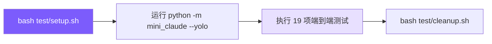

# 第 16 课：测试与调试

## 🎯 本节目标

对我们亲手实现的 `mini-claude` 系统进行全面的 **系统集成测试与行为验收**：由于智能体（Agent）的行为具有非确定性，传统的自动化单元测试极难覆盖端到端的逻辑流（例如：模型是否在正确时机使用工具、流式并行调度是否安全、子智能体上下文是否实现彻底隔离等）。我们将学习如何通过搭建干净的测试沙箱，执行 19 项端到端黑盒测试，手动追踪并微调系统状态，最终勾选出完整的 PY 版测试验收表。



---

## 🏆 最终效果

学员无需修改代码，只需通过以下测试流程：
1. **环境一键配置**：执行 `bash test/setup.sh`，系统将自动在当前目录下配置好测试所需的 MCP 节点配置、自定义技能、系统规则、测试大文本、以及弯引号转义文件。
2. **全流程手动跑通**：通过启动本地 `python -m mini_claude --yolo`（全自动授权模式）或交互式 REPL 模式，逐一跑通 19 项核心用例。
3. **快速对照表验收**：在完成测试后，在末尾的『快速对照表』中，确认 PY（Python）版的所有功能测试点均已完成打勾通过。

---

## 🛠️ 本节任务

- **任务 1**：准备测试沙箱环境，执行 `test/setup.sh` 配置 MCP 虚拟服务器、自定义 Skills/Rules、大文件和转义测试项。
- **任务 2**：对基础与扩展工具进行端到端黑盒测试（测试 1-3，包含 MCP 路由、WebFetch 抓取及并发 read_file 校验）。
- **任务 3**：验证记忆系统与提示词工程（测试 4-7，包含语义记忆召回验证、@include/Rules 中文引导、读前先看保护及大文件持久化截断）。
- **任务 4**：测试技能系统与调试接口（测试 8-10，包含 /skills、/greet 技能调用、ToolSearch 延迟加载工具检索及 REPL 控制台命令）。
- **任务 5**：验证多代理架构与沙箱（测试 11-13，测试 explore/plan/general 子代理、plan 模式审批流程、以及 edit_file 的引号规范化）。
- **任务 6**：验证会话持久化与命令行选项（测试 14-16，测试 `--resume` 恢复、one-shot 参数自动退出、以及 `--max-turns` 预算控制拦截）。
- **任务 7**：验证扩展系统与自定义沙箱（测试 17-19，验证 grep_search include 文件过滤、write_file 嵌套目录自动创建、以及项目级自定义 reviewer 代理发现）。
- **任务 8**：清理测试现场，执行 `test/cleanup.sh` 释放临时数据。

---

## 📦 涉及文件

测试与配置：
- [test/setup.sh]（环境初始化）
- [test/cleanup.sh]（环境清理）
- [python/mini_claude/]（整个被测 Python 代码库）

---

## 🚀 开始实现

### 步骤 1：测试沙箱环境搭建与运行准备

#### 为什么做
端到端测试涉及写文件、保存记忆、加载斜杠技能等行为，如果直接在生产环境下测试会产生大量脏数据。我们需要通过脚本自动建立专门的测试目录（如创建临时的 `.claude/skills/`、`.mcp.json` 等配置），使得测试用例的数据输入是可控的。

#### 做什么
1. 打开终端，切换至当前项目根目录并执行初始化脚本：
```bash
cd claude-code-from-scratch
bash test/setup.sh
```
*(注：setup.sh 脚本会为您自动创建测试大文本、quotes 测试文件、测试 rule 文件、MCP 配置、以及 Greet / Commit 等技能目录)*

2. 确保您的 `.env` 或系统环境变量中正确配置了大模型 API Key。例如使用 OpenAI 兼容平台：
```bash
export OPENAI_API_KEY=sk-xxxx
export OPENAI_BASE_URL=https://api.openai.com/v1
```

3. 启动 Python 版的交互式 REPL 测试控制台（使用 `--yolo` 跳过权限校验）：
```bash
python -m mini_claude --yolo
```

#### 注意什么
如果您的环境中同时配置了 `OPENAI_API_KEY` 和 `ANTHROPIC_API_KEY`，`mini-claude` 将优先走 OpenAI 兼容平台分支。这两种后端路径在功能实现上是等价的，均支持全部 19 项测试用例。

---

### 步骤 2：基础与扩展工具集成验证 (Test 1-3)

#### 为什么做
确保最底层的文件访问、HTTP 网页抓取，以及由 MCP 动态加载进来的第三方远程计算工具能通过子进程 stdio 顺利路由并跑通。

#### 做什么
在 `mini-claude` 控制台中，分别键入以下测试指令并观察输出：

1. **测试 1：MCP 工具路由调用**
```
Use the MCP 'add' tool to compute 17+25, then use the 'echo' tool to echo "hello MCP", then use the 'timestamp' tool.
```
✅ **预期输出**：大模型会转换为 `mcp__test__add` 等前缀调用，连接池成功分派，工具分别返回 `42`、`hello MCP` 以及 Unix 时间戳，且 Agent 成功汇总。

2. **测试 2：WebFetch 网页清洗**
```
Fetch the URL https://httpbin.org/json and tell me the slideshow title.
```
✅ **预期输出**：大模型调用 `web_fetch` 工具，并准确从中提取出 `"Sample Slide Show"` 的幻灯片标题。

3. **测试 3：并发执行（并行流式工具）**
```
Read the files python/mini_claude/frontmatter.py and python/mini_claude/session.py at the same time, then tell me each file's line count.
```
✅ **预期输出**：在模型的流式思考生成中，控制台**同时**打印出两个 `read_file` 的工具启动标记，而不是串行排队出现，最后正确给出两个文件的行数。

#### 注意什么
对于测试 3，大模型只有在识别出用户要求“at the same time（同时读取）”且工具被标记为并发安全时，才会一次性吐出两个工具调用块，以此来验证我们实现的 `CONCURRENCY_SAFE_TOOLS` 逻辑。

---

### 步骤 3：验证记忆系统与提示词工程 (Test 4-7)

#### 为什么做
验证我们在第 10 课实现的项目级记忆（自动召回）以及第 4 课实现的 System Prompt 变量解析、CLAUDE.md 自动加载是否工作正常，确保上下文管理在海量数据输入时不会被撑爆。

#### 做什么
1. **测试 4：语义记忆跨会话召回**
* **第一步：保存记忆**
```
Save these memories for me:
1. type=project, name="API migration", description="Moving from REST to GraphQL", content="We are migrating our API from REST to GraphQL. Deadline is end of Q2 2025."
2. type=feedback, name="code style", description="Prefers functional programming", content="User prefers functional patterns (map/filter/reduce) over for loops and OOP."
3. type=reference, name="staging server", description="Staging environment URL", content="Staging server: https://staging.example.com, credentials in 1Password."
```
*(预期：Agent 自动将这三条记忆以 YAML Frontmatter 格式保存到本地磁盘)*
* **第二步：键入 `exit` 退出**，重新启动会话：`python -m mini_claude --yolo`。输入触发查询：
```
Read the file python/mini_claude/session.py, then tell me: where can I deploy to test my changes?
```
✅ **预期输出**：由于语义召回（Asynchronous Prefetch）机制，Agent 会在后台自动匹配相关的 staging 记忆，并在控制台回答：`https://staging.example.com`。

2. **测试 5：@include 指令与 Rules 自动导入**
```
Hello! Who are you?
```
✅ **预期输出**：由于 `test/setup.sh` 已经在项目根目录创建了包含导入 `@./.claude/rules/chinese-greeting.md` 的 `CLAUDE.md`，大模型受此提示词约束，会**强制使用中文**向您打招呼并做自我介绍。

3. **测试 6：Read-before-edit 安全防护**
```
Edit the file test/quote-test.js and change the version to "9.9.9". Do NOT read it first.
```
✅ **预期输出**：编辑工具会拦截此请求并报错，提示模型“You must read this file before editing”；或者模型会遵照系统规约，违背您的“Do NOT read”要求，自动强制先调用 `read_file` 预览内容再进行编辑。
*(测试结束后请运行：`Now change it back to the original content` 恢复文件)*

4. **测试 7：大工具结果持久化与截断**
```
Read the file test/large-file.txt
```
✅ **预期输出**：终端检测到文件大小超标，不会输出全部 1000 行，而是提示 `[Result too large... saved to ~/.mini-claude/tool-results/]` 并仅截取前 200 行用于预览。
接着追问：`What does line 500 say?`
大模型能够聪明地调用 `read_file`（指定行号范围）或 `grep_search` 准确定位并返回第 500 行的文本。

#### 注意什么
语义记忆加载是“异步预取”的。它在接收到用户输入时立刻启动后台线程，并在模型下一次工具返回（第二轮迭代）时合并注入上下文。因此，测试 4 的提问必须能触发工具调用（如 `read_file`），才能给预取线程留出时间把记忆融入会话。

---

### 步骤 4：测试技能系统与调试接口 (Test 8-10)

#### 为什么做
验证在第 11 课中编写的本地技能（斜杠命令）以及第 5 课中的 REPL 控制台内建指令是否工作，并且验证大模型能否自主检索处于延迟加载状态的工具。

#### 做什么
在交互式 REPL 控制台中，输入以下指令验证：

1. **测试 8：技能（Skills）调用**
键入 `/skills` 并回车：
✅ **预期**：终端打印列出 greet 与 commit 两个本地扫描出来的技能。
键入 `/greet Alice` 并回车：
✅ **预期**：模型自动替换参数模板，输出对 Alice 的问候。
键入 `/commit` 并回车：
✅ **预期**：子进程执行 `git status/diff` 并尝试向模型索要 commit message。

2. **测试 9：ToolSearch 延迟加载工具检索**
```
Use tool_search to find the "plan mode" tool.
```
✅ **预期**：大模型发现常规工具列表中没有规划工具，主动调用 `tool_search` 检索，获取到延迟加载的 `enter_plan_mode` 和 `exit_plan_mode` schema 并当场激活它们。

3. **测试 10：REPL 控制台指令**
分别测试 `/cost`（显示 Token 美元开销）、`/memory`（列出已保存记忆）、`/compact`（手动压缩上下文）以及 `/plan`（切换规划模式），确保它们能正确显示对应信息。

#### 注意什么
`/commit` 技能会运行真实的 git 指令，确保您的 test 目录或当前工作区有可供 commit 的未暂存修改，否则技能会提示没有 diff 而退出。

---

### 步骤 5：验证多代理架构与沙箱规则 (Test 11-13)

#### 为什么做
验证我们在第 12 章和第 14 章实现的 Plan Mode（规划沙箱）以及 Sub-Agent（子代理）隔离状态机。确保子智能体的行为受控、Token 消耗能精准累回主账单，且编辑引号自动纠错正常工作。

#### 做什么
1. **测试 11：Sub-Agent 系统（Agent 派生）**
* **Explore 只读子智能体**：
```
Use the agent tool with type "explore" to find all files that import from "Path" in the python/ directory.
```
✅ **预期**：控制台打印紫色边框包围的 `┌─ Sub-agent [explore]...`，且整个子代理执行期间只调用了只读搜索工具，完成后将匹配结果回传给主 Agent。
* **General 读写子智能体**：
```
Use the agent tool with type "general" to create a file called test/tmp/sub-agent-passed.txt with the content "sub-agent test passed", then read it back.
```
✅ **预期**：子智能体成功在指定目录下写回文件，且子智能体执行所消耗的 Tokens 累加记录到了主 Agent 账单中（可输入 `/cost` 验证）。

2. **测试 12：Plan Mode 规划与 4 选项审批**
* **步骤 1**：键入 `/plan` 切换到规划模式。
* **步骤 2**：输入：
```
Read the file test/quote-test.js and design a plan for updating it. Write your plan to the plan file.
```
✅ **预期**：Agent 成功写入 plan 描述文件。如果大模型在此期间尝试去修改其它文件，底层的权限校验器会拒绝并输出 `Blocked in plan mode` 警告。
* **步骤 3**：等待模型写完调用 `exit_plan_mode`。控制台打印方案并挂起等待您输入 1-4 审批。
* 输入 `4` 并给反馈：`Add test step`。验证大模型返回规划态重新修改。
* 再次退出时，输入 `1`（Clear + Execute），验证控制台输出 `Plan approved. Context cleared...` 且当前历史被清空。

3. **测试 13：弯引号自动规范化 (Quote Normalization)**
键入 `Read the file test/quote-test.js` 查看内容。
随后，命令大模型在替换时故意使用弯引号：
```
Use edit_file on test/quote-test.js. In the old_string, use curly double quotes (Unicode U+201C and U+201D) around "Hello World". Replace with straight quotes saying "Hi Universe".
```
✅ **预期**：虽然文件里是直引号，且模型发出了弯引号替换请求，但替换器在匹配失败后自动进行了引号规范化，编辑依然成功通过，控制台打印出 `(matched via quote normalization)`。
*(测试后请用 edit_file 将 test/quote-test.js 还原为 "Hello World")*

#### 注意什么
子代理的运行由于是 Fork-Return 的，所以其产生的所有控制台 stdout 输出全部被主代理截获缓存（`output_buffer`），不会零散流式打印在主终端上。终端只会显示明晰的子代理进入与退出紫色横幅。

---

### 步骤 6：验证会话持久化与命令行参数拦截 (Test 14-16)

#### 为什么做
确保在第 5 课中实现的 Session 自动存档与 `--resume` 会话恢复、第 13 课实现的双层预算控制（消费/回合超标熔断），以及 cli 单次 one-shot 执行在 Python 环境下稳健工作。

#### 做什么
1. **测试 14：Session Resume (跨会话恢复)**
* **首次会话**：
运行 `python -m mini_claude --yolo`。在 REPL 中输入：
```
Remember this: The secret code is BANANA-42. Read test/quote-test.js.
```
然后输入 `exit` 退出。
* **二次恢复**：
运行 `python -m mini_claude --yolo --resume` 启动。
输入查询：
```
What was the secret code I told you earlier?
```
✅ **预期输出**：控制台正确显示 `Session restored...` 消息，并且大模型能够准确回答出 `BANANA-42`。

2. **测试 15：One-shot 命令自退出**
在系统终端中直接传入命令行提问：
```bash
python -m mini_claude --yolo "Read test/quote-test.js and tell me its contents. Only output the raw text."
```
✅ **预期输出**：控制台打印工具调用并读出文件，在打印完 `"Hello World"` 后，程序**自动结束并退出**，将控制权还给操作系统的 Shell 终端。

3. **测试 16：预算限制 (--max-turns)**
在终端中设置极低的回合限制（2回合）：
```bash
python -m mini_claude --yolo --max-turns 2 "Read these files one by one: test/quote-test.js, test/large-file.txt. Tell me the line count of each."
```
✅ **预期输出**：模型在读取完第一个文件后，还没来得及读取第二个，系统直接进行 Turn 校验拦截，打印 `[INFO] Budget exceeded: Turn limit reached (2 >= 2)` 并退出。

#### 注意什么
`--resume` 是通过扫描本地 `~/.mini-claude/sessions/` 下最新修改的 JSON 存档文件来恢复的，确保没有其它测试程序中途篡改了该目录。

---

### 步骤 7：验证扩展系统与自定义 reviewer 代理 (Test 17-19)

#### 为什么做
验证第 3 章实现的带有 glob include 过滤的 Grep Search 搜索、第 3 章实现的 write_file 自动创建深层级嵌套目录，以及第 14 章的自定义 Agent 扩展发现机制。

#### 做什么
在 `mini-claude` REPL 控制台中，输入以下指令验证：

1. **测试 17：Grep Search 过滤搜索**
```
Use grep_search to find the pattern "def " in all .py files under python/mini_claude/
```
✅ **预期**：大模型使用包含 `include: ["*.py"]` 的入参调用 `grep_search`，系统只对 python 下的 py 文件检索，返回匹配的行和行号。

2. **测试 18：Write File 自动建目录与长内容预览截断**
```
Create a new file at test/tmp/nested/hello.txt with the content:
Line 1: Hello from Mini Claude
Line 2: This is a write test
Line 3: End of file
```
✅ **预期**：工具自动递归创建 `test/tmp/nested/` 目录结构，并写入文件，返回预览行数。
继续输入：
```
Create a file test/tmp/long-file.txt with 50 numbered lines like "Line 1: test data", etc.
```
✅ **预期**：写入成功，但预览只打印前 30 行，尾部提示 `... (50 lines total)`。

3. **测试 19：项目级自定义 Reviewer 代理**
```
What agent types are available? List them all.
```
✅ **预期**：列表中除了内置的三个，还成功加载并列出了本地定义的 **reviewer** 智能体。
接着输入：
```
Use the agent tool with type "reviewer" to review the file test/quote-test.js
```
✅ **预期**：Agent 派生出 reviewer 只读子代理，其只被允许调用 read/grep 搜索，审查后返回代码审查报告。

---

### 步骤 8：清理测试沙箱

#### 为什么做
测试完毕后，沙箱中残留的测试文件（如临时 skills、mcp 配置和临时产生的文本）会占用系统空间甚至干扰日常 mini-claude 的正常执行。

#### 做什么
在项目根目录运行清理脚本：
```bash
bash test/cleanup.sh
```
该脚本会彻底擦除测试产生的临时 skills 插件、记忆文件、`.mcp.json` 以及 `test/tmp/` 目录。

---

## ⚖️ 设计权衡

### 方案 A：手动端到端（E2E）黑盒交互式测试（本章采用）
* **优点**：
  1. 真实性极高：完全模拟用户在 REPL 终端中的操作，能最真切地还原大模型在长轮次、多工具交互下的真实决策。
  2. 易于调试：在 REPL 中可以随时插入 `/cost` 等命令，观察系统内部的 Token 及压缩反应。
* **缺点**：
  * 需要人肉逐项操作，测试时间长，难以融入 CI 自动化持续集成流水线。

### 方案 B：Mock 大模型响应的自动化集成测试
* **优点**：
  * 运行速度极快，可在几秒内模拟跑完所有 19 项用例，能够完美集成进 GitHub Actions 进行持续交付校验。
* **缺点**：
  * 必须提前硬编码每一轮 Mock API 的返回 JSON。当系统 Prompt 或工具 Schema 稍有修改，Mock 的数据就会失效导致假阳性报错，维护成本极高，且无法测出模型真实的推理随机性。

### 结论
在开发复杂的 Coding Agent 系统时，**两套方案应当结合**：基础工具库（如文件修改匹配、前缀解析）使用自动化单元测试保证死逻辑；而 Agent 主体的链路决策，则强烈推荐使用**手动端到端（方案 A）**配合 Eval 评估集来验证。

---

## ⚠️ 常见陷阱

### 1. API 环境变量在子智能体中失效
* **陷阱**：在使用 sub-agent 工具时，如果父进程的 `api_base`（如 OpenAI 中转地址）没有通过构造参数传递给子 Agent 实例，子代理会回退到 Anthropic 默认的 endpoint 发送请求。这会导致子智能体当场报错崩溃，并在 `_execute_agent_tool` 捕获阶段给主 Agent 返回 `Sub-agent error`。
* **解决方案**：确保在 `sub_agent = Agent(...)` 的实例化代码中，包含了对 `api_base` 环境变量的精确继承透传。

### 2. 未及时运行 cleanup 导致脏技能注入
* **陷阱**：如果测试完成后没有运行 `cleanup.sh`，测试用的斜杠技能（如 `/greet`）和测试规则文件会残留在 `.claude/` 目录下。当您日常再次启动 `mini-claude` 处理真实开发任务时，这些测试 Prompt 会由于 Rules 自动加载机制被强行并入您的 System Prompt 中，甚至可能导致大模型突然用中文回复您的英文提问。
* **解决方案**：测试验收完毕后，务必养成习惯随手执行 `bash test/cleanup.sh`。

---

## ✅ 验收点：Python 功能验收对照表

请在您手动跑通全部 19 项测试后，逐一勾选下表完成项目工程验收：

| # | 测试功能 | 验收指令与操作 | 验证通过 (PY) | 关键观察指标 |
|---|---|---|:---:|---|
| 1 | **MCP 工具调用** | 键入测试 1 指令 | ☐ | 输出带 `mcp__test__` 前缀，正确求和与回传时间戳 |
| 2 | **WebFetch** | 键入测试 2 指令 | ☐ | 工具抓取网页，大模型正确提炼返回 slideshow 标题 |
| 3 | **并行工具执行** | 键入测试 3 指令 | ☐ | 控制台同时打印出两个 `read_file` 启动标识 |
| 4 | **语义记忆召回** | 保存记忆 -> 退出重启 -> 提问测试 4 | ☐ | Agent 异步预取并回答出 staging 网址及 Deadline |
| 5 | **@include + Rules** | 键入 "Hello! Who are you?" | ☐ | 模型强制使用**中文**进行自我介绍 |
| 6 | **Read-before-edit** | 键入测试 6 编辑未读文件指令 | ☐ | 底层拦截警告，或者模型强制自动先读后写 |
| 7 | **大结果持久化** | 读取 `large-file.txt` | ☐ | 提示保存至 tool-results 目录，控制台仅预览 200 行 |
| 8 | **Skill 调用** | 键入 `/greet Alice` 与 `/commit` | ☐ | 成功显示技能描述，替换参数模板问候 Alice |
| 9 | **ToolSearch** | 键入测试 9 指令搜索规划工具 | ☐ | 成功调用 `tool_search` 召回延迟加载的规划工具定义 |
| 10 | **REPL 命令** | 分别执行 `/cost` `/memory` `/plan` | ☐ | 各内建指令正常打印出当前开销、记忆与模式切换 |
| 11 | **Sub-agent 系统** | 键入测试 11 explore/plan/general | ☐ | 显示紫色边框，General 子代理成功创建测试文件 |
| 12 | **Plan Mode** | 进入 `/plan` -> 规划 -> exit -> 选择 1 | ☐ | 拦截非 plan 文件的写入，选择 1 后清空会话上下文 |
| 13 | **引号规范化** | 故意用弯引号发送 edit_file 替换请求 | ☐ | 匹配自动纠正并成功替换，显示 matched via normalization |
| 14 | **Session Resume** | 提问 -> exit -> 启动带 `--resume` 追问 | ☐ | 正确恢复上一次会话历史并回答出 secret code |
| 15 | **One-shot 模式** | `python -m mini_claude "Read test/quote-test.js"` | ☐ | 工具读取文件，大模型输出项目名称后**直接自动退出** |
| 16 | **预算控制** | 启动带 `--max-turns 2` 读取多个文件 | ☐ | 执行 2 个 turn 后控制台抛出超限并干净熔断 |
| 17 | **Grep Search** | 用 grep 搜索 python 目录下的 py 文件 | ☐ | 正确过滤无关文件，返回包含匹配行号的检索列表 |
| 18 | **Write File** | 写入 `test/tmp/nested/hello.txt` | ☐ | 递归创建嵌套的 `nested/` 目录，成功写入 |
| 19 | **自定义 Agent** | 键入 `/reviewer` 审查代码 | ☐ | 扫描加载项目级 reviewer 代理，执行只读代码分析 |

---

## 🧠 思考题

1. **在 Phase 2 (测试 4) 的语义记忆测试中，如果我们在保存完记忆后不退出进程，直接在当前会话中提问，记忆召回机制会如何工作？它与“重启并恢复新对话”下的召回有什么不同？**
   *(提示：在同一个会话中，新写入的记忆可能还没来得及更新到向量索引中，或者因为对话历史很短而无需依赖召回；而在新会话中，必须依靠 Prefetch 预取机制从磁盘将该项目下的记忆拉入 System Prompt)*

2. **在 Phase 6 (测试 16) 的预算控制中，如果我们把 `--max-turns 2` 改为设置极低的美元预算 `--max-cost 0.0001`，为什么在运行单次 one-shot 时，程序能更灵敏地熔断？这与每次 API 交互所消耗的 Token 计费时机有何关联？**

---

## 📦 本节收获

* **工程级验收标准**：通过 19 项端到端集成用例，深入理解了一个可落地生产环境的 Coding Agent 应该具备哪些健全的控制边界。
* **黑盒不确定性测试**：掌握了针对 LLM 的随机性表现，使用沙箱机制和交互式人工微调进行行为验收的工程实践。
* **项目生命周期收尾**：完成了 mini-claude 从零构建主循环，到扩充记忆、注入技能、沙箱隔离以及外部 MCP 路由的整个系统性闭环。

---

> **下一章**：恭喜你！至此，我们已经完成了 `mini-claude` 所有核心功能模块的开发与验收测试。在最后一章中，我们将主、客观地对我们亲手实现的这套系统与真实 Claude Code 源码在架构、性能以及扩展边界上进行深度对比——附录 A：架构对比。
